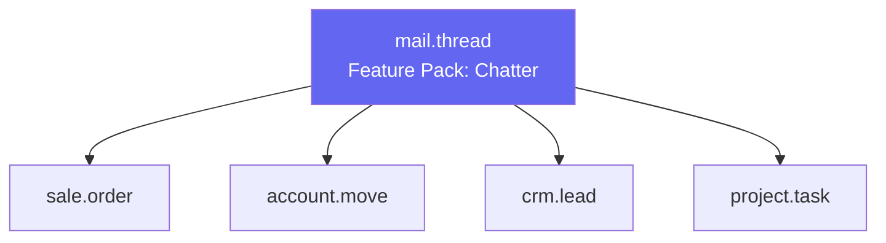
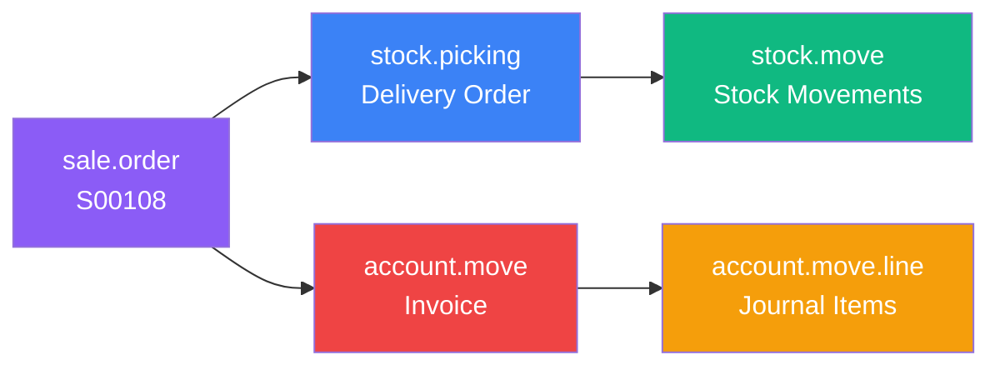

# Understanding Models - The Foundation

## What Is a Model?

::: info Technical Definition
A **Model** is a **table in the database** that stores a specific type of information.
Think of it like an Excel spreadsheet - each model is a different spreadsheet for different data.
:::

::: tip Excel Analogy
| Excel Concept | Odoo Concept | Example |
| :--- | :--- | :--- |
| Spreadsheet file | Model | `res.partner` (Contacts) |
| Column header | Field | `name`, `email`, `phone` |
| Row | Record | One specific customer |
| Cell | Field value | "John Smith" |
:::

## Model Naming Convention

Odoo models have a specific naming pattern: `module.object` or `module.parent.child`

| Model Name | What It Stores | Menu Location |
| :--- | :--- | :--- |
| `res.partner` | Customers, Vendors, Contacts | Contacts app |
| `res.users` | System Users (login accounts) | Settings > Users |
| `res.company` | Companies in the system | Settings > Companies |
| `sale.order` | Sales Orders / Quotations | Sales > Orders |
| `sale.order.line` | Individual lines on a sales order | Inside Sales Order form |
| `purchase.order` | Purchase Orders | Purchase > Orders |
| `account.move` | Invoices, Bills, Journal Entries | Accounting > Invoices |
| `stock.picking` | Delivery Orders, Receipts | Inventory > Transfers |
| `product.product` | Product Variants | Products with variants |
| `product.template` | Product Templates | Product form |
| `hr.employee` | Employees | Employees app |
| `project.project` | Projects | Project app |
| `project.task` | Tasks within projects | Project > Tasks |
| `crm.lead` | Leads and Opportunities | CRM app |

::: info Naming Pattern Explained
**Format:** `module.object` or `module.parent.child`
- `res` = "Resource" - core/base models used everywhere
- `sale` = Sales module models
- `purchase` = Purchase module models
- `account` = Accounting module models
- `stock` = Inventory module models
- `hr` = Human Resources models
- `crm` = Customer Relationship Management models
:::

## Types of Models

Odoo has three types of models. Each type stores data differently:

| Technical Name | What It Means | Data Storage | Examples |
| :--- | :--- | :--- | :--- |
| **Model** | Regular model - normal screens | Saved permanently in database | Contacts, Sales Orders, Invoices, Products |
| **TransientModel** | Temporary model - used for wizards (popup dialogs) | Auto-deleted after 1 hour (by default) | "Create Invoice" popup, "Register Payment" popup |
| **AbstractModel** | Template model - provides features to other models | Not stored (no database table) | mail.thread (adds chatter to any model) |

### TransientModel = Wizards

A **TransientModel** (also called a "wizard") is a popup window that appears when you click action buttons. It collects input and performs an action.

**"Transient" means temporary** - the data you enter in these popups is automatically deleted after about an hour. This keeps the database clean.

**Common wizards you use daily:**

| When You Click... | This Wizard Appears |
| :--- | :--- |
| Sales Order → "Create Invoice" button | Popup asking: Regular invoice or Down payment? |
| Invoice → "Register Payment" button | Popup asking: Payment amount, journal, date |
| Transfer → "Validate" (with partial qty) | Popup asking: Create backorder or not? |
| Settings → "Add a Language" | Popup asking: Which language to install? |

::: warning Important
If you close a wizard popup without clicking the action button, nothing is saved. That's normal - wizard data is meant to be temporary!
:::

### AbstractModel = Feature Packs

An **AbstractModel** is a reusable set of features that can be added to any model. It doesn't create its own database table - it just provides functionality that other models can use.

**Common AbstractModels in Odoo:**

| AbstractModel | What It Adds | Where You See It |
| :--- | :--- | :--- |
| `mail.thread` | Chatter (messages, followers, log) | Bottom of Sales Orders, Invoices, Contacts |
| `mail.activity.mixin` | Scheduled Activities | "Plan Activity" button on records |
| `portal.mixin` | Customer portal access | "Share" or "Preview" button on quotations |

#### How It Works: Chatter Example



All these models have chatter at the bottom of their forms. Instead of coding chatter 4 times, Odoo coded it once in `mail.thread` and each model simply says "I want those features".

**In Code: How Sale Order Gets Chatter**

```python
class SaleOrder(models.Model):
    _name = 'sale.order'
    _inherit = ['mail.thread', 'mail.activity.mixin']  # ← Gets chatter + activities!

    name = fields.Char(string='Order Reference')
    partner_id = fields.Many2one('res.partner')
    # ... other fields
```

The `_inherit` line adds all the chatter functionality. Without it, no chatter would appear on the form.

::: tip Key Points
- **If you see chatter on a form** → that model inherits `mail.thread`
- **If a form has "Plan Activity" button** → that model inherits `mail.activity.mixin`
- **Need chatter on a custom model?** → Tell developers to add `_inherit = ['mail.thread']`
- **Each record has its own messages** → The feature is shared, but data is separate per record
:::

## How to Find a Model Name

::: tip Method 1: Enable Developer Mode
1. Go to Settings > General Settings
2. Scroll down and click "Activate Developer Mode"
3. Go to any form view
4. Click the bug icon (Debug menu) > "View Metadata"
5. You'll see the model name (e.g., `sale.order`)
:::

::: tip Method 2: URL Inspection
Look at the URL in your browser. In Odoo 17+, URLs use path segments:

`https://mycompany.odoo.com/odoo/sale.order/5`

The model name appears in the URL path! (Older versions used hash format: `#model=sale.order&id=5`)
:::

## How Data is Actually Stored - The Relational Database

While the Excel analogy helps understand the basics, Odoo uses a **relational database (PostgreSQL)** which is more powerful. The key difference: **tables are connected to each other using IDs**.

When you create a Sales Order in Odoo, you're not just creating one record - you're creating **multiple records across several tables**, all linked together by their IDs.

### What Happens When You Create a Sales Order?

Let's say you create a quotation for customer "Acme Corp" with 2 product lines. Here's what actually gets stored in the database:

#### 1. The Contacts Table (`res_partner`)
| id | name | email | phone |
| :--- | :--- | :--- | :--- |
| **42** | Acme Corp | contact@acme.com | +1 555-0100 |

#### 2. The Products Table (`product_product`)
| id | name | list_price | default_code |
| :--- | :--- | :--- | :--- |
| **15** | Laptop Pro | 1,200.00 | LAPTOP-001 |
| **23** | Wireless Mouse | 45.00 | MOUSE-001 |

#### 3. The Sales Order Header (`sale_order`)
| id | name | partner_id 🔗 | date_order | state | amount_total |
| :--- | :--- | :--- | :--- | :--- | :--- |
| **108** | S00108 | **42** → Acme Corp | 2024-12-09 | draft | 2,490.00 |

#### 4. The Sales Order Lines (`sale_order_line`)
| id | order_id 🔗 | product_id 🔗 | product_uom_qty | price_unit | price_subtotal |
| :--- | :--- | :--- | :--- | :--- | :--- |
| 201 | **108** → S00108 | **15** → Laptop Pro | 2 | 1,200.00 | 2,400.00 |
| 202 | **108** → S00108 | **23** → Mouse | 2 | 45.00 | 90.00 |

::: info Legend
🔗 = Foreign Key (ID linking to another table)
:::

### Understanding the Relationships

| The "Header" Record | The "Line" Records |
| :--- | :--- |
| **sale_order** (id: 108) | **sale_order_line** (ids: 201, 202) |
| Stores order-level info: date, state, totals | Each product line = separate record |
| `partner_id = 42` links to the customer | `order_id = 108` links back to header |
| This is ONE record for the whole order | `product_id` links to the product |

### Why IDs Matter - The Magic of Relational Databases

Every record in Odoo has a unique **id** (also called primary key). This ID is:

- **Auto-generated:** Odoo creates it automatically when you save
- **Unique:** No two records in the same table have the same ID
- **Permanent:** Once assigned, the ID never changes
- **The Link:** Other tables reference this ID to create relationships

**Example:** When Odoo displays "Acme Corp" on the sales order, it's actually reading `partner_id = 42`, then looking up id 42 in the res_partner table to get the name.

### The Full Picture: What Confirming a Sales Order Creates

When you click **"Confirm"** on a quotation, Odoo creates even more records:



All these records are linked back to the original Sale Order using IDs!

::: warning Why This Matters for Consultants
- **Debugging:** When something looks wrong, understanding that data lives in multiple tables helps you investigate
- **Reports:** Custom reports often need to join multiple tables using these ID relationships
- **Data Migration:** Moving data between systems requires understanding these connections
- **Smart Buttons:** Those counts you see (like "2 Deliveries") are queries counting related records by ID
:::

### Excel vs Relational Database - Key Difference

| Concept | Excel Approach | Odoo/Database Approach |
| :--- | :--- | :--- |
| **Customer name on order** | Type "Acme Corp" directly in cell | Store ID 42, look up name from res_partner |
| **Customer changes name** | Must update every order manually | Update once in res_partner, all orders show new name |
| **Order lines** | Multiple columns: Product1, Qty1, Product2, Qty2... | Separate table with unlimited rows, linked by order_id |
| **Find all orders for customer** | Manually search/filter | Query: WHERE partner_id = 42 |

## The Meta-Models (Registry)

### `ir.model` (Model Registry)

`ir.model` is Odoo's **meta-model** - it stores information about all models in the system.

**Location:** Settings → Technical → Database Structure → Models

| Field | Type | Description |
| :--- | :--- | :--- |
| `name` | Char | Human-readable model name (e.g., "Sales Order") |
| `model` | Char | Technical model name (e.g., "sale.order"). Custom models start with "x_" |
| `order` | Char | Default SQL ordering (e.g., "date desc, id desc") |
| `info` | Text | Model documentation/description |
| `field_id` | One2many | Link to all fields defined on this model (ir.model.fields) |
| `access_ids` | One2many | Access control rules for this model (ir.model.access) |
| `rule_ids` | One2many | Record rules / row-level security (ir.rule) |
| `state` | Selection | `manual` = Created via Studio/UI, `base` = Defined in Python code |
| `transient` | Boolean | True for wizard models (auto-deleted after use) |
| `abstract` | Boolean | True for mixin models (no database table) |
| `modules` | Char (computed) | Which installed modules define/extend this model |
| `view_ids` | One2many (computed) | All views (form, tree, kanban, etc.) for this model |
| `count` | Integer (computed) | Total number of records in this model |

### `ir.model.fields` (Field Registry)

`ir.model.fields` stores metadata about every field in Odoo.

**Location:** Settings → Technical → Database Structure → Fields

This is where Studio stores custom field definitions.

| Field | Type | Description |
| :--- | :--- | :--- |
| `name` | Char | Technical field name (e.g., "partner_id"). Custom fields start with "x_" |
| `field_description` | Char | Human-readable label shown in UI (e.g., "Customer") |
| `model_id` | Many2one | The model this field belongs to (ir.model) |
| `ttype` | Selection | Field type: char, integer, float, boolean, date, datetime, text, html, binary, selection, many2one, one2many, many2many, reference, monetary, properties |
| `relation` | Char | For relational fields: target model name (e.g., "res.partner") |
| `relation_field` | Char | For One2many: the Many2one field on the related model |
| `required` | Boolean | Field must have a value (cannot be empty) |
| `readonly` | Boolean | Field cannot be edited by users |
| `index` | Boolean | Database index for faster searches |
| `store` | Boolean | True = saved in database, False = computed on-the-fly |
| `copied` | Boolean | Value is copied when duplicating records |
| `translate` | Selection | Translation mode: standard, html_translate, xml_translate |
| `company_dependent` | Boolean | Different value per company (multi-company) |
| `domain` | Char | Filter for relational fields (e.g., "[('active','=',True)]") |
| `selection` | Char | For Selection fields: list of options |
| `compute` | Char | Python method name for computed fields |
| `depends` | Char | Fields that trigger recomputation |

## Auto-Generated Fields (Magic Columns)

Every Odoo model automatically gets these 5 fields:

| Field | Type | Description |
| :--- | :--- | :--- |
| `id` | Integer | Unique identifier (primary key) |
| `create_uid` | Many2one | User who created the record |
| `create_date` | Datetime | When the record was created |
| `write_uid` | Many2one | User who last modified the record |
| `write_date` | Datetime | When the record was last modified |

::: tip Quick Tips
- 💡 Every model gets 5 magic columns: `id`, `create_uid`, `create_date`, `write_uid`, `write_date`
- 💡 Custom fields must start with `x_` (or `x_studio_` if created via Studio)
- 💡 `_rec_name` controls what shows in dropdowns (default is `name`)
- 💡 The `active` field (if present) controls the "Archived" filter
:::

## Practical Use Cases

### Finding Which Module a Model Belongs To

1. Enable Developer Mode
2. Go to Settings → Technical → Database Structure → Models
3. Search for the model name
4. Look at the "Modules" field to see which module(s) define it

### Finding All Fields on a Model

1. Enable Developer Mode
2. Go to Settings → Technical → Database Structure → Fields
3. Filter by Model = your model name
4. You'll see all fields including custom ones

### Checking If a Model Has Chatter

1. Look at the form - is there a message log at the bottom?
2. Or: Go to ir.model, search for the model, check if it inherits `mail.thread`

## Common Mistakes

::: danger Common Mistakes to Avoid
- **Custom field name rejected**: You forgot the `x_` prefix
- **Dropdown shows "42" instead of name**: The model has no `name` field and `_rec_name` isn't set
- **Wizard data lost**: You closed the wizard without clicking a button (TransientModels are temporary)
- **Can't find a record**: The record might be archived - check the "Active" filter
- **"Unknown model" error**: The module defining the model isn't installed
:::

## Knowledge Check

::: details Q1: What's the difference between Model and TransientModel?
**Answer:** Model stores data permanently in the database; TransientModel auto-deletes old records (used for wizards/popups).
:::

::: details Q2: Which columns exist automatically on every model?
**Answer:** `id`, `create_uid`, `create_date`, `write_uid`, `write_date`
:::

::: details Q3: What prefix must custom fields have?
**Answer:** `x_` for manual creation, `x_studio_` for Studio-created fields
:::

::: details Q4: Why might a dropdown show an ID number instead of a name?
**Answer:** The related model has no `name` field and no `_rec_name` is configured to specify an alternative display field.
:::

::: details Q5: Where can you see all models in the system?
**Answer:** Settings → Technical → Database Structure → Models (requires Developer Mode)
:::

::: details Q6: What does mail.thread add to a model?
**Answer:** The chatter feature - messages, followers, and activity log at the bottom of forms.
:::
