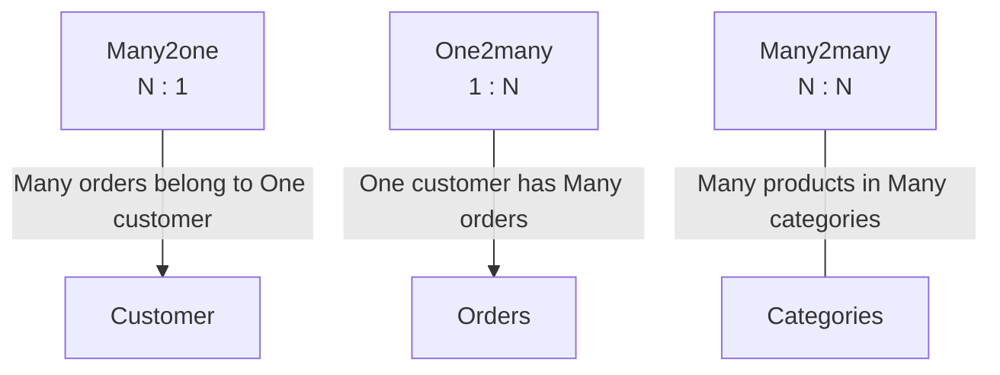
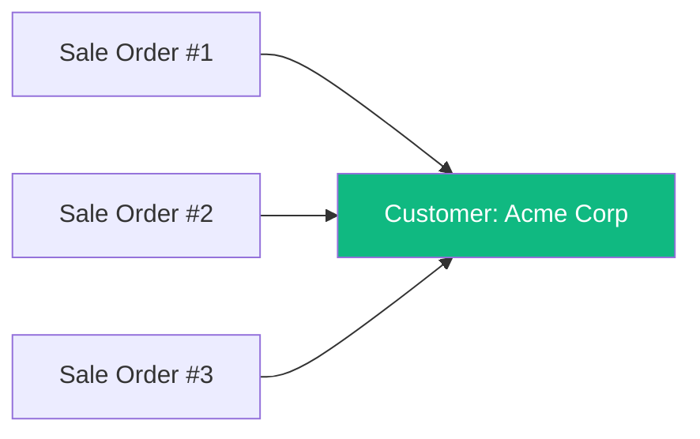
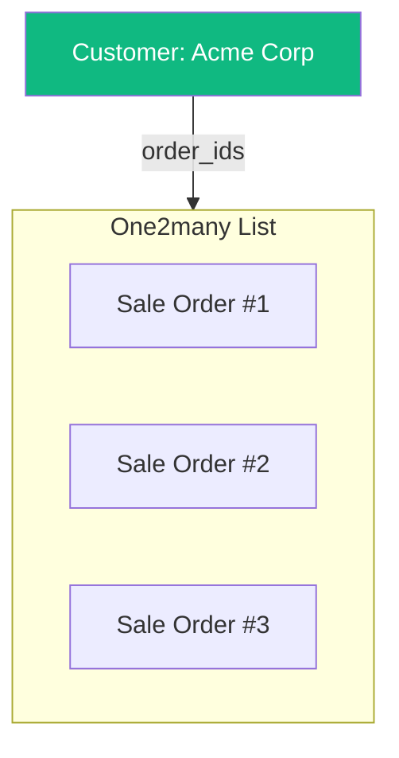

# Relationships - Many2one, One2many, Many2many

::: danger Why Relationships Are Critical
Relationships connect data across different models. Understanding them is **important** for:
- Understanding how data flows in Odoo
- Creating proper filters and reports
- Designing new features correctly
:::

## The Three Relationship Types

| Type | Cardinality | UI Display | Database Storage |
| :--- | :--- | :--- | :--- |
| **Many2one** | Many → One | Dropdown | Foreign key ID in column |
| **One2many** | One → Many | Embedded list | Not stored (virtual) |
| **Many2many** | Many ↔ Many | Tags/multi-select | Junction table |

## Many2one - The Dropdown Link

::: info What Is Many2one?
A **Many2one** field creates a link from **many records** in one model to **one record** in another model.
- **UI:** Dropdown / Search field
- **Storage:** Just an ID number (foreign key)
- **Example:** Many Sale Orders → One Customer
:::

### Real-World Example: Sales Orders

**Many** Sale Orders can belong to **One** Customer.

### Common Many2one Fields

| Field | On Model | Links To | Business Meaning |
| :--- | :--- | :--- | :--- |
| `partner_id` | `sale.order` | `res.partner` | Which customer is this order for? |
| `product_id` | `sale.order.line` | `product.product` | Which product is on this line? |
| `company_id` | (many models) | `res.company` | Which company owns this record? |
| `user_id` | `sale.order` | `res.users` | Who is the salesperson? |
| `department_id` | `hr.employee` | `hr.department` | Which department? |
| `project_id` | `project.task` | `project.project` | Which project does this task belong to? |

### Many2one Field Attributes

| Attribute | Purpose | Example |
| :--- | :--- | :--- |
| `comodel_name` | Target model | `'res.partner'` |
| `ondelete` | What happens when target is deleted | `'restrict'`, `'cascade'`, `'set null'` |
| `domain` | Filter available options | `[('is_company', '=', True)]` |
| `context` | Pass context to linked views | `{'default_type': 'out_invoice'}` |

## One2many - The Reverse View

::: info What Is One2many?
A **One2many** field shows all records that link back to the current record via a Many2one.
- **Important:** One2many fields are **NOT stored in the database**. They are computed by looking at the reverse relationship.
- **UI:** Embedded list/table (e.g., order lines within an order)
:::

### Real-World Example: Customer's Orders

On the Customer form, you see a list of all their orders:

The customer doesn't "store" these orders - Odoo looks up "all orders where partner_id = this customer"

### One2many Field Attributes

| Attribute | Purpose | Example |
| :--- | :--- | :--- |
| `comodel_name` | Target model (the child) | `'sale.order.line'` |
| `inverse_name` | Many2one field on child pointing back | `'order_id'` |
| `domain` | Filter which records to show | `[('state', '=', 'active')]` |
| `copy` | Copy lines when duplicating parent | `True` or `False` |

::: warning One2many Limitations
Because One2many is not stored in the database, you **cannot**:
- Use it in "Group By" reports
- Filter by it directly in domains (some limitations)
- Export it directly to Excel (export from child model instead)
:::

## Many2many - Multiple Links Both Ways

::: info What Is Many2many?
A **Many2many** field allows linking **multiple records** on both sides.
- **Storage:** Creates a "junction table" in the database
- **UI:** Tags or multi-select dropdown
:::

### Real-World Example

**Products** ↔ **Categories**

| Product | Categories |
| :--- | :--- |
| Laptop | Electronics, Computers, Office Equipment |
| Keyboard | Electronics, Office Supplies, Computer Accessories |
| Mouse | Electronics, Computer Accessories |

The same product can be in multiple categories, and the same category can contain multiple products.

### Common Many2many Fields

| Field | On Model | Links To | Usage |
| :--- | :--- | :--- | :--- |
| `tag_ids` | `sale.order` | `crm.tag` | Categorizing orders |
| `category_id` | `res.partner` | `res.partner.category` | Customer tags |
| `tax_ids` | `sale.order.line` | `account.tax` | Multiple taxes on one line |
| `user_ids` | `res.groups` | `res.users` | Users in a security group |

### Many2many Field Attributes

| Attribute | Purpose | Example |
| :--- | :--- | :--- |
| `comodel_name` | Target model | `'res.partner.category'` |
| `relation` | Junction table name | `'partner_category_rel'` |
| `column1` | Column for current model ID | `'partner_id'` |
| `column2` | Column for target model ID | `'category_id'` |

## Quick Reference: Relationship Summary

| Type | Stored? | UI Display | Can Group By? | Example |
| :--- | :--- | :--- | :--- | :--- |
| **Many2one** | Yes (ID) | Dropdown | Yes | Order → Customer |
| **One2many** | No | Embedded List | No | Customer → Orders |
| **Many2many** | Yes (Junction) | Tags | Limited | Product ↔ Categories |

## Deletion Behavior (`ondelete`)

When you delete a record (e.g., a Customer), what happens to the linked records (Orders)?

| Behavior | Effect | Example |
| :--- | :--- | :--- |
| **Restrict** | **Blocks deletion** (Error message) | Can't delete Customer if they have Invoices |
| **Set Null** | **Clears the link** (Field becomes empty) | Employee leaves; tasks stay but `user_id` cleared |
| **Cascade** | **Deletes linked records** | Delete an Order → All Order Lines deleted |

::: warning "Cannot Delete" Errors
If you get a "Reference Error" preventing deletion, it's usually `ondelete='restrict'`. You must first archive, reassign, or delete the related records.
:::

### Real-World Analogy

| Behavior | Analogy |
| :--- | :--- |
| **Restrict** | Can't close a bank if customers have money there |
| **Set Null** | Employee leaves company - their records stay but employer field is cleared |
| **Cascade** | Delete a department - all positions in it are also eliminated |

## Understanding Related Fields

::: info Definition
A **related field** displays information from a linked record directly on the current form.
It "reaches through" a Many2one to show data.
**Example:** Showing the Customer's **Country** on the **Sales Order**.
:::

### Common Related Fields You See Daily

| Visible On | Shows Field | Source Path |
| :--- | :--- | :--- |
| Sales Order | Customer's delivery address | `partner_shipping_id.street` |
| Invoice Line | Invoice Status (Draft/Posted) | `move_id.state` |
| Stock Move | Customer on the transfer | `picking_id.partner_id` |
| Employee | Manager Name | `department_id.manager_id.name` |

### Stored vs Not Stored Related Fields

| Type | Behavior | Use Case |
| :--- | :--- | :--- |
| **Not Stored (Default)** | Always live data, can't group by | Display-only info |
| **Stored** | Copies value, can group by, might get "stale" | Reporting, filtering |

::: warning Stale Data Risk
Stored related fields copy the value at the time it's computed. If the source changes without triggering recomputation, the related field may show outdated data.
:::

## Relationship Decision Guide

| Business Need | Relationship Type | Example |
| :--- | :--- | :--- |
| Link to one other record (dropdown selection) | **Many2one** | Order → Customer |
| Show all linked items as a list | **One2many** | Customer form showing all their orders |
| Tag or categorize with multiple options | **Many2many** | Product ↔ Multiple categories |
| Display info from linked record (read-only) | **Related field** | Show customer's country on order |

## Common Business Patterns

### Pattern 1: Document with Lines

Almost every business document in Odoo follows this structure:

| Header (Parent) | Lines (Children) |
| :--- | :--- |
| Sales Order | Sales Order Lines |
| Purchase Order | Purchase Order Lines |
| Invoice (`account.move`) | Invoice Lines (`account.move.line`) |
| Delivery Order (`stock.picking`) | Stock Moves (`stock.move`) |

The header "owns" the lines. Delete an order → lines are deleted too (cascade).

### Pattern 2: Hierarchies (Self-References)

Some models have parent-child relationships within themselves:

| Model | Hierarchy Example |
| :--- | :--- |
| Product Categories | Electronics > Computers > Laptops |
| Departments | Sales > Europe > France |
| Chart of Accounts | Assets > Current Assets > Bank |
| Locations | Warehouse > Shelf A > Bin 1 |

These use a `parent_id` Many2one field pointing to the same model.

### Pattern 3: Tagging / Categorization

When something can belong to multiple categories simultaneously:

| Model | Tag Field | Usage |
| :--- | :--- | :--- |
| CRM Leads | `tag_ids` | Hot Lead, VIP, Trade Show |
| Products | `product_tag_ids` | Multiple website categories |
| Contacts | `category_id` | Supplier, Reseller, Partner |

These use Many2many relationships displayed as colored tags in the UI.

## Product Template vs Product Variant

::: danger Confusing Concepts - Must Understand!
`product.template` and `product.product` are two different models!

| Model | Definition | Example |
| :--- | :--- | :--- |
| `product.template` | **The Master** (Shared info) | "T-Shirt" with name, description, category |
| `product.product` | **The Variant** (Specific item) | "T-Shirt, Red, Size M" with unique barcode |

**Key insight:** Sales orders use `product.product` (variant), but the product form edits `product.template`.
:::

### Similarly: Users and Partners

`res.users` (login accounts) "inherits" from `res.partner` (contacts). Every user IS a contact with additional login capabilities:

- Creating a user automatically creates a contact
- User's name, email, phone come from their partner record
- You can message a user through the contact system

## Why Can't I Group By Some Fields?

::: info One2many Fields Are Virtual
One2many fields don't actually exist in the database - they're calculated on-the-fly. This means:
- **Cannot Group By:** "Group orders by order lines" doesn't make sense
- **Cannot Filter Directly:** Use the child model instead
- **Cannot Export:** Export from the line model, not the parent
:::

### Workaround: Filter Through Child Model

Instead of trying to filter orders by product on the order line:
- **Wrong approach:** Search orders where order_line contains product X
- **Right approach:** Search order lines for product X, then look at their orders

In the UI, use the **order line list view** and group by Order to see the same data.

## Knowledge Check

::: details Q1: Sales Order to Order Lines - what relationship?
**Answer: One2many on Order, Many2one on Line**

The line stores the `order_id` (Many2one), and the order has a One2many pointing back.
:::

::: details Q2: Which relationship creates an actual column in the database?
**Answer: Many2one**

Many2one stores the foreign key ID in the table. One2many is virtual. Many2many uses a separate junction table.
:::

::: details Q3: Products and Tags - what relationship?
**Answer: Many2many**

Multiple products can have multiple tags. Odoo creates a junction table to store the connections.
:::

::: details Q4: What happens when you delete a customer with orders if ondelete='restrict'?
**Answer: Deletion is blocked with an error message**

Restrict prevents deletion and shows an error. You must first delete/archive the orders.
:::

::: details Q5: Why can't you Group By a One2many field?
**Answer: One2many fields are not stored in the database**

They're computed on-the-fly by looking at the reverse Many2one relationship. Since there's no column, there's nothing to group by.
:::

::: details Q6: What's the difference between product.template and product.product?
**Answer: Template is the master, Product is the variant**

`product.template` stores shared info (name, description). `product.product` stores variant-specific info (barcode, specific attributes). Sales orders use the variant.
:::
