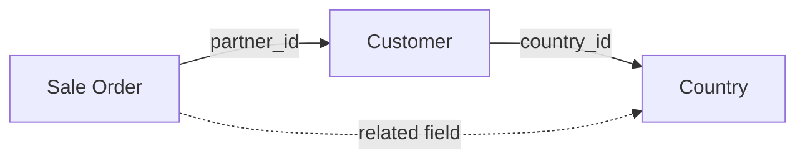

# Related Fields Explained

::: info Definition
A **related field** displays a value from a **linked record** on the current form.
It "reaches through" a Many2one relationship to show information from the related record.
:::

## How It Works



### Example: Showing Customer's Country on Sales Order

| Model | Field | Target |
| :--- | :--- | :--- |
| Sale Order | `partner_id` → | Customer (res.partner) |
| Customer | `country_id` → | Country (res.country) |

A related field `partner_country_id` on Sale Order can directly show the customer's country without storing it!

**Path:** `partner_id.country_id`

### Code Example

```python
# On sale.order model
partner_country_id = fields.Many2one(
    'res.country',
    related='partner_id.country_id',
    string='Customer Country',
    store=False,  # Default - always reads from linked record
)
```

## Stored vs Not Stored Related Fields

| Feature | `store=False` (Default) | `store=True` |
| :--- | :--- | :--- |
| **Value** | Always live (reads from linked record) | Copied to database |
| **Updates** | Immediate when source changes | When source changes (via triggers) |
| **Group By** | **No** | **Yes** |
| **Search/Filter** | Limited | Full support |
| **Performance** | Can cause N+1 queries | Fast (indexed) |
| **Stale Risk** | Never stale | May become outdated |

### When to Use store=False (Default)

- You just want to **display** information on a form
- The linked value changes frequently
- You don't need to filter or group by it
- Database space is a concern

### When to Use store=True

- You need to **Group By** this field in reports
- You need to **filter** or **search** by this field
- The field is displayed in **list views** (performance)
- You're building **reports** that query the database directly

## The N+1 Query Problem

::: warning Performance Warning
If you have a **non-stored related field** and display it in a list view with 100 records:
- Odoo might need to make 100 separate database queries (one per record)
- This can slow down the page significantly

**Solution:** If the field is shown in list views, consider `store=True`
:::

### How to Detect N+1 Issues

| Symptom | Likely Cause |
| :--- | :--- |
| List view loads slowly | Non-stored related fields in columns |
| Form view fast, list view slow | Too many computed/related fields in list |
| Timeout on large datasets | Unstored fields multiplying queries |

## Common Related Fields in Odoo

| Where | Related Field | Path | Stored? |
| :--- | :--- | :--- | :--- |
| Sale Order Line | Product Category | `product_id.categ_id` | Depends |
| Invoice Line | Invoice State | `move_id.state` | Often Yes |
| Stock Move | Customer | `picking_id.partner_id` | Yes |
| Task | Project Manager | `project_id.user_id` | Depends |
| Employee | Department Manager | `department_id.manager_id` | Often No |

## Chained Related Fields

You can chain through multiple relationships:

```python
# On project.task, show the project manager's country
manager_country_id = fields.Many2one(
    'res.country',
    related='project_id.user_id.partner_id.country_id',
    string='Manager Country',
)
```

**Path:** Task → Project → Manager (User) → Partner → Country

::: warning Chain Length
Longer chains = more potential for:
- Performance issues (more joins)
- Stale data (more points of change)
- Confusion (harder to understand the source)

Keep chains to 2-3 levels when possible.
:::

## The Stale Data Problem

::: danger When Stored Related Fields Don't Update
Stored related fields should update when the source changes, but sometimes they don't:

**Common Causes:**
1. Developer forgot to define proper dependencies
2. Data was imported directly to database
3. Batch update bypassed normal Odoo flows
4. Bug in the recomputation logic

**Fix:** Edit and save the record, or ask developer to run recomputation.
:::

## Related vs Computed Fields

| Aspect | Related Field | Computed Field |
| :--- | :--- | :--- |
| **Purpose** | Fetch value from linked record | Calculate based on any logic |
| **Syntax** | `related='path.to.field'` | `compute='_compute_method'` |
| **Flexibility** | Limited to following relationships | Unlimited Python logic |
| **Dependencies** | Automatic from path | Must define with `@api.depends` |
| **Best For** | Displaying linked data | Calculations, aggregations |

### When to Use Each

| Scenario | Use |
| :--- | :--- |
| Show customer's email on order | **Related** - just following a link |
| Calculate order total | **Computed** - summing line values |
| Show product category | **Related** - `product_id.categ_id` |
| Show days until deadline | **Computed** - date calculation |
| Display linked record's name | **Related** - simple path |
| Combine multiple fields | **Computed** - custom logic needed |

## Practical Examples

### Example 1: Customer Information on Invoice

```python
class AccountMove(models.Model):
    _inherit = 'account.move'

    # Related fields to show customer info
    customer_email = fields.Char(
        related='partner_id.email',
        string='Customer Email',
    )
    customer_phone = fields.Char(
        related='partner_id.phone',
        string='Customer Phone',
    )
    customer_country_id = fields.Many2one(
        'res.country',
        related='partner_id.country_id',
        string='Customer Country',
        store=True,  # Stored for reporting
    )
```

### Example 2: Product Info on Order Line

```python
class SaleOrderLine(models.Model):
    _inherit = 'sale.order.line'

    # Show product category for filtering
    product_categ_id = fields.Many2one(
        'product.category',
        related='product_id.categ_id',
        string='Product Category',
        store=True,  # Can group sales by category
    )
    product_type = fields.Selection(
        related='product_id.detailed_type',
        string='Product Type',
    )
```

## Knowledge Check

::: details Q1: Why can't you Group By a non-stored related field?
**Answer: No database column exists**

Group By uses SQL which requires a real column in the database. Non-stored related fields are calculated on-the-fly and have no column.
:::

::: details Q2: When should you add store=True to a related field?
**Answer: When you need to filter, group, or search by it**

Also consider storing it if the field appears in list views with many records (performance) or is used in reports.
:::

::: details Q3: What causes the N+1 query problem?
**Answer: Non-stored related fields in list views**

Each row in the list requires a separate query to fetch the related value, multiplying database calls.
:::

::: details Q4: A stored related field shows outdated data. What happened?
**Answer: The field wasn't recalculated when the source changed**

This can happen with direct database imports, batch updates, or missing dependency triggers. Fix by saving the record or running recomputation.
:::

::: details Q5: Related field vs computed field - which for showing linked customer name?
**Answer: Related field**

For simply displaying data from a linked record, use related. Computed is for calculations or custom logic.
:::
