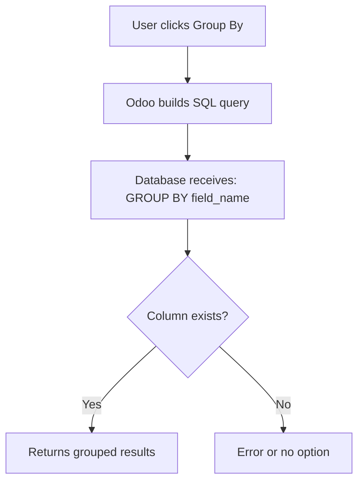

# Why Group By Requires Stored Fields

::: danger The Problem
You want to run a report "Sales by Customer Country", but the Group By option is missing or fails.
**Reason:** The database cannot group by something that doesn't exist as a column.
:::

## How Group By Works (SQL)

When you click "Group By" in Odoo, here's what happens:

1. Odoo sends a SQL query to PostgreSQL: `SELECT ... GROUP BY country_id`
2. PostgreSQL looks for the `country_id` column in the table
3. **If the field is not stored**, there is no column
4. **Result**: Error or the option doesn't appear



### Analogy: Library Card Catalog

| Stored Field | Non-Stored Field |
| :--- | :--- |
| Like having "Genre" written on each book's card | Like calculating "Days since published" |
| Easy to sort all cards by genre | Would need to look at each book individually |
| Pre-indexed for fast grouping | Can't pre-sort by it |

## The Solution: Make the Field Stored

To group by a computed or related field, you must **store** it:

| Requirement | Solution |
| :--- | :--- |
| Group by computed field | Add `store=True` to field definition |
| Group by related field | Add `store=True` to field definition |
| Group by One2many | **Impossible** - virtual field, no column |
| Group by Many2many | Complex - uses junction table |

::: tip For Functional Consultants
If a client asks for a specific grouping in a report, check if the field is stored **first**. If not, it's a small development task to make it stored.
:::

## Common Group By Scenarios

### Scenarios That Work (Stored Fields)

| Report Need | Field | Works? | Why |
| :--- | :--- | :--- | :--- |
| Sales by Customer | `partner_id` | ✅ Yes | Many2one is stored |
| Invoices by Status | `state` | ✅ Yes | Selection field is stored |
| Orders by Salesperson | `user_id` | ✅ Yes | Many2one is stored |
| Products by Category | `categ_id` | ✅ Yes | Many2one is stored |
| Invoices by Total | `amount_total` | ✅ Yes | Stored computed field |

### Scenarios That Need Work (Non-Stored Fields)

| Report Need | Field | Works? | Solution |
| :--- | :--- | :--- | :--- |
| Sales by Customer Country | `partner_id.country_id` | ❌ No | Add stored related field |
| Tasks by Days Remaining | (computed) | ❌ No | Store the computed field |
| Orders by Margin % | (computed) | ❌ No | Add `store=True` |
| Products by Stock Level | `qty_available` | ❌ No | Context-dependent, can't store |

## Why Some Fields Can Never Be Grouped

### Context-Dependent Fields

These fields show different values based on context and **cannot be stored**:

| Field | Why It Can't Be Stored |
| :--- | :--- |
| `qty_available` | Different per warehouse/location |
| Pricelist prices | Different per customer/pricelist |
| My Tasks | Different per user |
| Current company data | Different per company |

### One2many Fields

One2many fields are **virtual** - they don't have a database column:

```
❌ Can't Group By: "Group orders by order lines"
   (One2many has no column to group)

✅ Alternative: Group order lines by order
   (The line's order_id is a Many2one and IS stored)
```

## Practical Examples

### Example 1: Group Sales by Customer Country

**Problem:** Want to see "Sales by Customer Country" but country isn't on sale.order.

**Solution:** Add a stored related field:

```python
class SaleOrder(models.Model):
    _inherit = 'sale.order'

    partner_country_id = fields.Many2one(
        'res.country',
        related='partner_id.country_id',
        string='Customer Country',
        store=True,  # ← This makes Group By work!
    )
```

Now you can Group By → Customer Country in the sales list view.

### Example 2: Group by Profit Margin

**Problem:** Want to filter "Orders with margin > 20%" but margin is computed.

**Solution:** Ensure the computed field has `store=True`:

```python
margin_percent = fields.Float(
    compute='_compute_margin',
    store=True,  # ← Required for filtering/grouping
)

@api.depends('price_unit', 'product_id.standard_price')
def _compute_margin(self):
    for line in self:
        cost = line.product_id.standard_price
        if line.price_unit:
            line.margin_percent = (line.price_unit - cost) / line.price_unit * 100
        else:
            line.margin_percent = 0
```

## Debugging Group By Issues

### Step 1: Check If Field Is Stored

1. Enable **Developer Mode** (Settings → Activate Developer Mode)
2. Go to **Settings → Technical → Database Structure → Fields**
3. Search for the model and field name
4. Check the **Stored** column

### Step 2: Understand the Field Type

| Field Type | Stored by Default? | Can Store? |
| :--- | :--- | :--- |
| Char, Integer, Float, Boolean | Yes | N/A |
| Many2one | Yes | N/A |
| Selection | Yes | N/A |
| One2many | **Never** | **No** |
| Many2many | Yes (junction table) | N/A |
| Computed | No | Yes, add `store=True` |
| Related | No | Yes, add `store=True` |

### Step 3: Request the Fix

When asking a developer to make a field groupable:

> "We need to Group By [field name] in [view name].
> Currently it's not stored. Please add `store=True` to the field definition
> and ensure proper `@api.depends` for recomputation triggers."

## The Trade-offs of Storing Fields

| Benefit | Cost |
| :--- | :--- |
| Can Group By in reports | Takes database space |
| Can filter/search efficiently | Must recalculate when source changes |
| Fast to read | May become stale if not properly triggered |
| Works in pivot tables | Adds complexity to data model |

## Knowledge Check

::: details Q1: Why can't you Group By a non-stored computed field?
**Answer: No database column exists**

Group By uses SQL, which requires real database columns. Non-stored fields are calculated on-the-fly and have no column to group by.
:::

::: details Q2: Can you ever Group By a One2many field?
**Answer: No - One2many is always virtual**

One2many fields never have a database column. They're computed by looking at the reverse Many2one relationship. Use the child model and group by the parent instead.
:::

::: details Q3: How do you make a computed field groupable?
**Answer: Add store=True to the field definition**

```python
my_field = fields.Float(
    compute='_compute_my_field',
    store=True,  # ← Add this
)
```

Also ensure `@api.depends` lists all trigger fields.
:::

::: details Q4: Why can't qty_available (Stock on Hand) be grouped by?
**Answer: It's context-dependent**

Stock quantity varies by warehouse, location, and date. There's no single value to store - it must be calculated based on context each time.
:::

::: details Q5: Client wants "Sales by Customer Industry". What do you check first?
**Answer: Is there a stored field for industry on the order?**

Check if there's a stored field linking to industry. If not, request a stored related field: `partner_id.industry_id` with `store=True`.
:::
