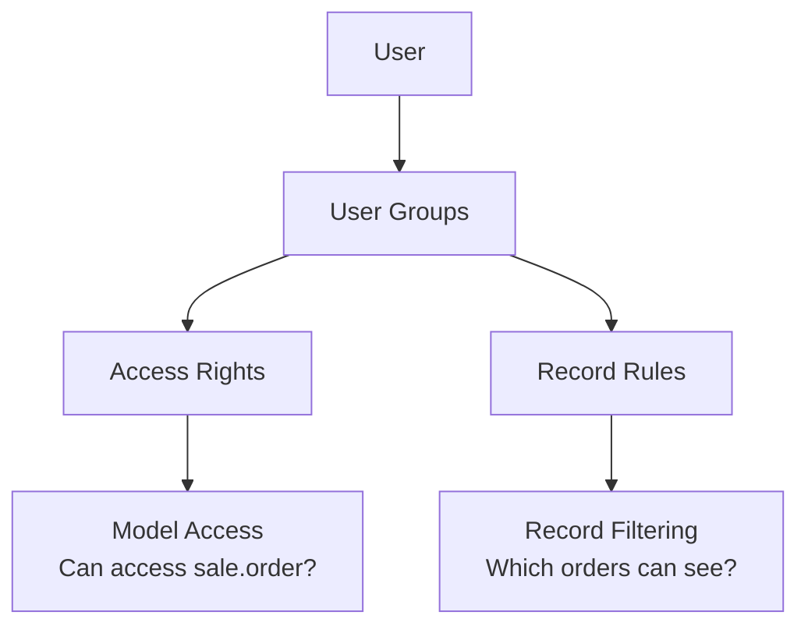

# Access Rights & Record Rules

::: danger Security in Odoo: Two Levels
1. **Access Rights (ir.model.access)** - Can this user group access this model at all?
2. **Record Rules (ir.rule)** - Which specific records can they see/edit?
:::

## The "Access Denied" Story

You've set up a new salesperson. They log in and click on Sales → Orders... **"Access Denied"**. What went wrong?

Understanding Odoo's two-level security system is essential for troubleshooting and configuring user permissions correctly.

**Think of it like a building:**
- **Access Rights** = Which rooms (models) can you enter?
- **Record Rules** = Once inside the room, which items (records) can you see?



## Access Rights - Model Level

### The Four Permissions: CRUD

| Permission | Letter | What It Allows | Example |
| :--- | :--- | :--- | :--- |
| **Create** | C | Create new records | Add new sales orders |
| **Read** | R | View existing records | See orders in list/form |
| **Update** | U | Edit existing records | Modify order lines |
| **Delete** | D | Delete records | Remove cancelled orders |

### Example: Sales Module Access

| Group | Model | C | R | U | D |
| :--- | :--- | :--- | :--- | :--- | :--- |
| Sales / User | sale.order | ✓ | ✓ | ✓ | ✗ |
| Sales / Manager | sale.order | ✓ | ✓ | ✓ | ✓ |
| Sales / User | sale.report | ✗ | ✓ | ✗ | ✗ |
| Accounting / Invoicing | account.move | ✓ | ✓ | ✓ | ✗ |

### Where Access Rights Are Defined

**Location:** Settings → Technical → Security → Access Rights

Each access right record contains:
- **Name:** Description of the permission
- **Model:** Which model it applies to
- **Group:** Which user group gets this permission
- **CRUD checkboxes:** Which operations are allowed

## Record Rules - Record Level

### What Record Rules Do

Record rules use **domains** to filter which specific records a user can access.

**Example:** "Sales users can only see orders assigned to them"
**Domain:** `[('user_id', '=', user.id)]`

### Common Record Rule Patterns

| Rule Name | Domain | Effect |
| :--- | :--- | :--- |
| Own records only | `[('user_id', '=', user.id)]` | See only records you created/own |
| Same company | `[('company_id', 'in', company_ids)]` | See only your company's data |
| Same team | `[('team_id', '=', user.sale_team_id.id)]` | See your sales team's records |
| Public records | `['|', ('public', '=', True), ('user_id', '=', user.id)]` | Public OR own records |
| Followers only | `[('message_partner_ids', 'in', user.partner_id.ids)]` | Records you follow |

### Record Rule Operations

Each record rule can apply to different operations:

| Operation | When Applied |
| :--- | :--- |
| **Read** | Viewing records in lists, forms, reports |
| **Write** | Editing existing records |
| **Create** | Creating new records |
| **Unlink** | Deleting records |

::: warning Global vs Non-Global Rules
- **Global rules** (no group assigned): Apply to ALL users, combined with AND
- **Non-global rules** (group assigned): Apply only to that group, combined with OR among same group's rules
:::

## Groups: How Users Get Permissions

Users don't get permissions directly - they get **assigned to groups**, and groups have permissions.

### Group Hierarchy Example - Sales

| Level | Group Name | Inherits From | Special Access |
| :--- | :--- | :--- | :--- |
| Basic | Sales / User: Own Documents | - | See own quotations/orders only |
| Medium | Sales / User: All Documents | Own Documents | See all team quotations/orders |
| Full | Sales / Administrator | All Documents | Configuration + delete access |

*Each level inherits permissions from the level below it.*

### How to Check/Assign Groups

1. Go to **Settings → Users & Companies → Users**
2. Select a user
3. Scroll down to see permission checkboxes organized by app
4. Check/uncheck to assign/remove groups

### Finding a Group's Technical Name

For automation and development, you often need the technical group name:

1. Settings → Technical → Security → Groups
2. Search for the group
3. Look at the **External ID** (e.g., `sales_team.group_sale_manager`)

## Field-Level Security

Beyond model and record access, individual fields can be restricted:

```python
credit_limit = fields.Float(
    groups="account.group_account_manager"  # Only accounting managers see this
)
```

### Common Field-Level Restrictions

| Field Type | Common Groups | Why Restrict? |
| :--- | :--- | :--- |
| Credit Limit | `account.group_account_manager` | Financial sensitivity |
| Cost Price | `purchase.group_purchase_manager` | Margin protection |
| Salary | `hr.group_hr_manager` | Privacy |
| API Keys | `base.group_system` | Security |

## Troubleshooting Guide

::: warning "Access Denied" or Missing Records
Check in this order:

1. **User groups:** Settings → Users → select user → Groups tab
   *Are they in the right groups? Sales/User? Sales/Manager?*

2. **Model access rights:** Settings → Technical → Security → Access Rights
   *Does their group have Read permission on the model?*

3. **Record rules:** Settings → Technical → Security → Record Rules
   *Is there a domain restricting which records they can see?*

4. **Field groups:** Check if specific fields are hidden by `groups=` attribute
:::

### Common Issues and Solutions

| Problem | Likely Cause | Solution |
| :--- | :--- | :--- |
| Menu completely missing | Not in any group for that app | Assign to Sales/User, Purchase/User, etc. |
| "Access Denied" error | No Read permission on model | Add user to appropriate group |
| Can see menu but 0 records | Record rule filtering all records | Check record rules, may need "All Documents" group |
| Some fields invisible | Field has `groups=` restriction | Add user to the required group |
| Can view but can't edit | No Update permission | Check access rights for the group |

## Where to Configure Access Rights (Without Code)

| What You Want | Where to Configure | Example |
| :--- | :--- | :--- |
| Assign user to a group | Settings → Users → user form | Give Maria "Sales / Administrator" role |
| See what a group can access | Settings → Technical → Security → Access Rights | What can "Sales / User" group do? |
| Change record-level restrictions | Settings → Technical → Security → Record Rules | Let salespeople see all orders |
| Create custom group | Settings → Technical → Security → Groups | Create "Sales Viewer" group |
| See group inheritance | Settings → Technical → Security → Groups | View "Inherited" tab |

## Real Scenario: New Employee Onboarding

Your company hired a new sales rep, Priya. She needs to:
- Create and manage her own quotations
- See (but not edit) products and customers
- Not see other salespeople's orders

**Solution:**
1. Create user for Priya (Settings → Users → Create)
2. Assign group: **Sales / User: Own Documents Only**
3. The record rules automatically limit her to her own records

Done! No coding required for standard permission setups.

## Multi-Company Security

In multi-company environments, record rules automatically include company filtering:

```python
# Automatic company rule added by Odoo
[('company_id', 'in', company_ids)]
```

This ensures users only see records from companies they have access to.

### Checking Company Access

1. Settings → Users → select user
2. Look at **Allowed Companies** field
3. User sees records from all allowed companies (combined)

## Knowledge Check

::: details Q1: User sees menu but only their own orders. What controls this?
**Answer: Record Rules (ir.rule)**

Record Rules use domains to filter WHICH records a user can see. A rule like `[('user_id', '=', user.id)]` restricts users to only their own records.
:::

::: details Q2: User can't see "Credit Limit" field but managers can. Why?
**Answer: The field has a `groups="..."` attribute**

Field-level security using `groups="account.group_account_manager"` restricts visibility to specific user groups.
:::

::: details Q3: New user doesn't see Manufacturing menu. First thing to check?
**Answer: Whether they're assigned to a Manufacturing user group**

Menus are linked to user groups. No group = no menu visibility. Check Settings → Users → user form → Manufacturing section.
:::

::: details Q4: What's the difference between Access Rights and Record Rules?
**Answer: Access Rights control model access; Record Rules filter specific records**

Access Rights: "Can this group access sale.order at all?"
Record Rules: "Which sale.order records can they see?"
:::

::: details Q5: How do you find a group's technical name for automation?
**Answer: Settings → Technical → Security → Groups → check External ID**

The External ID (like `sales_team.group_sale_manager`) is needed for automated actions, domains, and development.
:::
