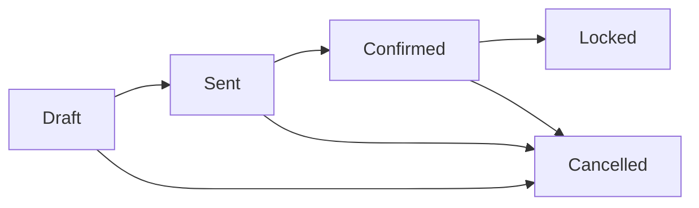

# Workflows & Status Management

## How Odoo Manages Document States

Most business documents in Odoo follow a **state machine** pattern:
- A `state` Selection field tracks the current status
- Buttons trigger state changes
- Business logic runs on transitions

::: tip Why Workflows Matter
Every time you click "Confirm" on a quotation, "Validate" on an invoice, or "Done" on a task, you're using Odoo's workflow system.

Understanding workflows helps you:
- **Explain to users** why they can't edit a confirmed order
- **Configure automation** that triggers on state changes
- **Troubleshoot** why a document is "stuck" in a certain state
- **Design custom workflows** for your business processes
:::

## Example: Sales Order Workflow



| State | Key (stored) | What Can Happen |
| :--- | :--- | :--- |
| Quotation | `draft` | Edit freely, Send to customer, Confirm, Cancel |
| Quotation Sent | `sent` | Customer reviewing, Confirm, Cancel |
| Sales Order | `sale` | Confirmed, Creates delivery & invoice |
| Locked | `done` | Prevents modification |
| Cancelled | `cancel` | Voided, can set back to draft |

::: info Note: Locked State in Odoo 19
In Odoo 19, use the **locked** boolean field to prevent modifications on completed orders. The statusbar shows the progression through workflow stages.
:::

## The Statusbar Widget

The statusbar widget shows the workflow visually at the top of forms:

```
┌──────────────────────────────────────────────────────────────────┐
│  [Quotation]  →  [Quotation Sent]  →  [Sales Order]  →  [Locked] │
│      ○               ○                    ●               ○      │
└──────────────────────────────────────────────────────────────────┘
```

**Features:**
- Shows all possible states
- Highlights current state (filled circle)
- Users can click to jump to states (if allowed by workflow)
- Can be configured to show only certain states

### Statusbar in XML

```xml
<header>
    <button name="action_confirm" string="Confirm"
            type="object" invisible="state != 'draft'"/>
    <field name="state" widget="statusbar"
           statusbar_visible="draft,sent,sale"/>
</header>
```

## Common Odoo Workflows

| Document | States | Key Transitions |
| :--- | :--- | :--- |
| **Sales Order** | Draft → Sent → Sale → Lock | Confirm creates delivery/invoice |
| **Purchase Order** | Draft → Sent → To Approve → Purchase | Confirm creates receipt |
| **Invoice** | Draft → Posted → Cancel | Post creates journal entries |
| **Inventory Transfer** | Draft → Waiting → Ready → Done | Validate updates stock |
| **Manufacturing Order** | Draft → Confirmed → Progress → Done | Produces finished goods |
| **CRM Lead** | Stages (customizable) | Won/Lost as final stages |
| **Project Task** | Stages per project | Kanban drag & drop |
| **Expense** | Draft → Submitted → Approved → Posted | Manager approval flow |
| **Leave Request** | Draft → Confirmed → Approved/Refused | HR approval workflow |

## State vs Stage: What's the Difference?

::: warning Key Distinction
| Aspect | State (Selection Field) | Stage (Many2one Field) |
| :--- | :--- | :--- |
| **Definition** | Fixed choices defined in code | Configurable records in database |
| **Customizable?** | No (requires code change) | Yes (add/edit/reorder stages) |
| **Used for** | Documents with fixed workflow | Documents with flexible workflow |
| **Example** | Invoice: Draft, Posted, Cancel | CRM stages: New, Qualified, Won |
| **Widget** | statusbar, badge | kanban columns |

**Key insight:** Stages give end users flexibility. States enforce business rules in code.
:::

### When to Use Each

| Use Case | Recommendation |
| :--- | :--- |
| Fixed legal/financial process | **State** - Invoice must be Draft → Posted |
| Customizable sales pipeline | **Stage** - Each team has different stages |
| Manufacturing with strict steps | **State** - MO must follow sequence |
| Support ticket workflow | **Stage** - Teams can customize |
| Approval workflow | **State** - Clear approve/reject |

## What Happens When State Changes?

State transitions often trigger business logic automatically:

### Sales Order Confirmation (`draft` → `sale`)

1. Reserves stock for products
2. Creates delivery order(s)
3. May create invoice (depending on settings)
4. Sends confirmation email (if configured)
5. Updates opportunity stage (if linked)

### Invoice Posting (`draft` → `posted`)

1. Creates journal entries in accounting
2. Updates partner balance
3. Assigns invoice number
4. Records in tax reports
5. Prevents further editing

### Stock Transfer Validation (`assigned` → `done`)

1. Updates quantity on hand
2. Creates stock valuation entries
3. Updates product cost (if applicable)
4. Completes linked sales/purchase

::: danger Why You Can't "Undo" State Changes
Once you confirm/post/validate, downstream documents and entries already exist. Reversing would require:
- Cancelling deliveries
- Reversing journal entries
- Updating stock quantities

That's why Odoo often provides "Cancel" or "Reverse" options instead of simple undo.
:::

## Fields That Change with State

Many fields become readonly or required based on state:

```xml
<!-- Customer readonly after confirmation -->
<field name="partner_id" readonly="state != 'draft'"/>

<!-- Delivery date required when confirmed -->
<field name="commitment_date" required="state == 'sale'"/>

<!-- Payment terms invisible when cancelled -->
<field name="payment_term_id" invisible="state == 'cancel'"/>
```

### Common Patterns

| State | Typical Field Behavior |
| :--- | :--- |
| Draft | All fields editable |
| Confirmed | Key fields readonly (customer, products) |
| Done/Posted | Most fields readonly |
| Cancelled | Display only, no editing |

## Configuring Automation on State Changes

Want something to happen automatically when a state changes? Use **Automated Actions**:

### Setting Up State Change Automation

1. **Settings → Technical → Automation → Automated Actions**
2. Create new action for your model (e.g., `sale.order`)
3. Set trigger: **"On Update"**
4. Add filter using Before/After Update Domains:
   - Before: `[('state', '=', 'draft')]`
   - After: `[('state', '=', 'sale')]`
5. Configure action: Send email, create record, update field, etc.

### Example Automations

| Trigger | Action | Configuration |
| :--- | :--- | :--- |
| Order confirmed | Email to warehouse | Before: draft, After: sale, Send Email |
| Invoice posted | Notify accountant | Before: draft, After: posted, Send Email |
| Lead won | Create project | Before: not won, After: won, Create Record |
| Task done | Update project progress | Before: not done, After: done, Execute Code |

## Troubleshooting Workflow Issues

### "Why can't I edit this field?"

| Symptom | Check | Solution |
| :--- | :--- | :--- |
| Field is grayed out | Current state | May need to cancel/reset to draft |
| Field shows but won't save | `readonly` attribute | Check view XML for state conditions |
| Button missing | `invisible` condition | Check button visibility rules |

### "Document is stuck in a state"

| Issue | Common Cause | Solution |
| :--- | :--- | :--- |
| Can't confirm order | Missing required fields | Check for red-highlighted fields |
| Can't validate transfer | No stock available | Check inventory or force availability |
| Can't post invoice | Missing journal | Configure default journals |
| Can't approve | Waiting for prior approval | Check approval workflow chain |

### "I need to reverse a posted document"

| Document | Reversal Method |
| :--- | :--- |
| Invoice | Create credit note (reversal entry) |
| Payment | Create reversal payment |
| Stock transfer | Create return transfer |
| Journal entry | Create reversal entry |

## Creating Custom Workflows

For custom models or modifications, workflows are defined by:

1. **State field** - Selection field with possible states
2. **Transition methods** - Python methods that change state
3. **Button definitions** - XML buttons calling those methods
4. **View attributes** - `readonly` and `invisible` conditions

### Example: Custom Approval Workflow

```python
state = fields.Selection([
    ('draft', 'Draft'),
    ('submitted', 'Submitted'),
    ('approved', 'Approved'),
    ('rejected', 'Rejected'),
], default='draft')

def action_submit(self):
    self.state = 'submitted'

def action_approve(self):
    self.state = 'approved'
    # Additional approval logic

def action_reject(self):
    self.state = 'rejected'
```

```xml
<header>
    <button name="action_submit" string="Submit"
            invisible="state != 'draft'"/>
    <button name="action_approve" string="Approve"
            invisible="state != 'submitted'"
            groups="base.group_manager"/>
    <button name="action_reject" string="Reject"
            invisible="state != 'submitted'"
            groups="base.group_manager"/>
    <field name="state" widget="statusbar"/>
</header>
```

## Knowledge Check

::: details Q1: User can't edit customer after confirming order. Why?
**Answer: State change triggered downstream documents linked to that customer**

Confirming creates deliveries and invoices referencing the customer. Changing the customer would create data inconsistency, so the field becomes readonly.
:::

::: details Q2: Difference between State and Stage?
**Answer: States are fixed in code; Stages are user-configurable records**

States (Selection field) have fixed values requiring code changes. Stages (Many2one field) are database records users can add/edit/reorder.
:::

::: details Q3: How to send email when order is confirmed (without code)?
**Answer: Settings → Technical → Automated Actions with "On Update" trigger**

Create automated action with Before Domain `[('state','=','draft')]` and After Domain `[('state','=','sale')]`, then configure Send Email action.
:::

::: details Q4: Why can't you simply "undo" a posted invoice?
**Answer: Posting created journal entries that affect accounting**

Posted invoices create journal entries, update partner balances, and appear in tax reports. You must create a credit note (reversal) instead.
:::

::: details Q5: How to make a field required only when status is "confirmed"?
**Answer: Add `required="state == 'confirmed'"` in the view XML**

Conditional attributes in views can depend on field values: `required`, `readonly`, and `invisible` all support expressions.
:::
