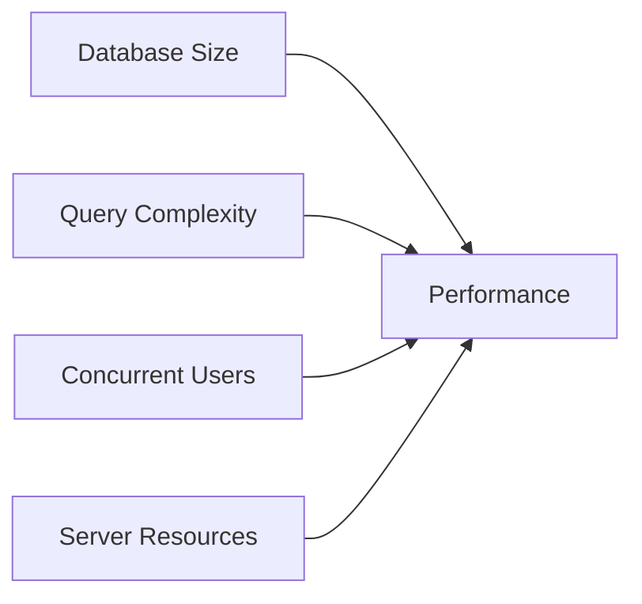

# Performance Considerations

::: info Why Performance Matters
As your Odoo database grows, poor design choices become painfully obvious:
- Slow page loads frustrate users
- Reports that timeout disrupt operations
- Searches that take forever reduce productivity
- High server costs from inefficient queries

Understanding performance helps you make better design decisions and troubleshoot issues.
:::

## The Performance Equation



Performance issues typically emerge when:
- Database grows beyond 100K records in key tables
- Many users access the system simultaneously
- Complex automations run on every save
- Non-stored computed fields appear in list views

## Key Performance Factors

| Factor | Impact | Solution |
| :--- | :--- | :--- |
| **Non-stored computed fields** | Calculated every page load | Store if used in lists/reports |
| **Non-stored related fields** | N+1 query problem in lists | Store if shown in list views |
| **Missing indexes** | Slow searches and filters | Add `index=True` to frequently searched fields |
| **Large One2many lists** | Slow form loading | Paginate or load on demand |
| **Complex domains** | Slow record rule evaluation | Simplify or cache results |
| **Too many automated actions** | Slow saves | Consolidate or use scheduled actions |
| **AI/LLM calls in loops** | Timeout, high IAP costs | Batch requests, use caching |
| **Large XML/EDI file processing** | Memory spikes, slow imports | Process in batches, use queue jobs |
| **Unoptimized reports** | Long generation times | Pre-compute data, use pagination |
| **Heavy onchange methods** | Sluggish form interactions | Minimize onchange complexity |

## Stored vs Non-Stored Fields

### The N+1 Query Problem

When you display a non-stored related field in a list view with 100 records:

```
Without store=True:
→ 1 query to get 100 sale orders
→ 100 queries to get each partner's country
= 101 queries total (N+1 problem)

With store=True:
→ 1 query to get 100 sale orders with country
= 1 query total
```

::: danger Performance Rule
**Any field shown in a list view should be stored.** This is the #1 cause of slow list views in Odoo.
:::

### When to Store Fields

| Use Case | Should Store? | Reason |
| :--- | :--- | :--- |
| Field in list view | ✅ Yes | Avoid N+1 queries |
| Field in search filter | ✅ Yes | Enables indexing |
| Field in Group By | ✅ Yes | Required for SQL GROUP BY |
| Field in reports | ✅ Yes | Speeds up report generation |
| Field only on form | ❌ Maybe | Single record, less impact |
| Context-dependent value | ❌ No | Value varies by context |

### Example: Slow List View

**Problem:** Sales orders list is slow to load.

**Investigation:**
1. Check which fields are displayed
2. Look for related fields without `store=True`
3. Check for computed fields without `store=True`

**Common culprits:**
```python
# SLOW - computed on every load
partner_country = fields.Char(
    related='partner_id.country_id.name'
)

# FAST - computed once, stored in database
partner_country = fields.Char(
    related='partner_id.country_id.name',
    store=True
)
```

## Database Indexing

### What Indexes Do

Indexes are like a book's index - they help find data without scanning every row.

| Without Index | With Index |
| :--- | :--- |
| Scans entire table | Jumps directly to matching rows |
| O(n) - linear time | O(log n) - logarithmic time |
| 100K records = slow | 100K records = fast |

### When to Add Indexes

| Field Usage | Should Index? |
| :--- | :--- |
| Used in search filters | ✅ Yes |
| Used in record rules | ✅ Yes |
| Used in domains frequently | ✅ Yes |
| Primary foreign keys (Many2one) | Auto-indexed |
| Rarely searched fields | ❌ No |
| Low-cardinality fields | ⚠️ Limited benefit |

### Adding Indexes

```python
# In field definition
reference = fields.Char(index=True)

# For existing fields, request development to add:
# CREATE INDEX idx_sale_order_ref ON sale_order(reference);
```

::: warning Index Trade-offs
Indexes speed up reads but slow down writes. Don't index everything - only frequently searched fields.
:::

## Record Rules vs Domains

::: danger Understanding the Difference
- **Record Rules** = Security filtering (WHO can see WHAT records)
- **Domains** = Business filtering (WHICH records to display in a specific context)
:::

### Performance Comparison

| Aspect | Record Rules | Domains |
| :--- | :--- | :--- |
| **Purpose** | Security/Access Control | Filter/UX convenience |
| **Applied** | Automatically on ALL operations | Only in specific context |
| **Scope** | Global - affects entire system | Local - affects only that view/field |
| **User control** | Cannot be bypassed by users | Users can clear/modify filters |
| **Performance** | Evaluated on EVERY read/write | Evaluated only when needed |
| **Visibility** | Hidden from users | Visible as filters |

### Record Rule Performance Impact

Record rules are evaluated on EVERY database operation:

```
User opens list view with 1000 records:
→ Record rule evaluated 1000 times
→ Complex rule = slow page load

User saves one record:
→ Record rule evaluated to check access
→ Complex rule = slow save
```

::: warning Performance Impact
**Record Rules** are evaluated on EVERY database operation. Complex record rules = slow system!

- **Bad:** Record rule with subquery or computed field → evaluated thousands of times per page
- **Good:** Record rule on stored, indexed field → fast lookup
:::

### Use Case Decision Guide

| Scenario | Use Record Rule | Use Domain |
| :--- | :--- | :--- |
| Salesperson sees only their own leads | ✅ Security requirement | ❌ |
| Default filter shows only "Open" opportunities | ❌ | ✅ UX convenience |
| Users can only access their own company's data | ✅ Multi-company security | ❌ |
| Product field shows only "Storable" products | ❌ | ✅ Field filtering |
| Warehouse manager sees only their warehouse orders | ✅ Data isolation | ❌ |
| Show only confirmed orders in a dashboard | ❌ | ✅ View filtering |
| HR manager sees only their department's employees | ✅ Privacy/Security | ❌ |
| Customer dropdown shows only active customers | ❌ | ✅ Field domain |

::: tip Decision Rule
- **Ask: "Should the user NEVER see these records?"** → Use Record Rule
- **Ask: "Is this just a helpful default filter?"** → Use Domain
- **Ask: "Is this a security/privacy requirement?"** → Use Record Rule
- **Ask: "Can a power user need to see all records sometimes?"** → Use Domain
:::

::: tip Analogy
- **Record Rule** = Building security badge - you can only enter floors your badge allows, no matter which elevator button you press.
- **Domain** = Floor directory sign - shows you where to find what you're looking for, but doesn't stop you from going elsewhere.
:::

## Automated Actions Performance

### The Hidden Cost

Every automated action fires on matching record changes:

```
10 automated actions on sale.order
User saves order
→ 10 automations evaluated
→ Matching ones execute
→ Each may trigger more saves
→ Cascade effect = slow saves
```

### Optimization Strategies

| Problem | Solution |
| :--- | :--- |
| Too many automations | Consolidate into fewer, multi-action rules |
| Automations on every save | Add specific trigger fields |
| Complex conditions | Simplify or move to scheduled action |
| Email on every change | Batch notifications with scheduled action |

### When to Use Scheduled Actions Instead

| Scenario | Automated Action | Scheduled Action |
| :--- | :--- | :--- |
| Immediate notification | ✅ | |
| Batch processing | | ✅ |
| Non-urgent updates | | ✅ |
| Complex calculations | | ✅ |
| External API calls | | ✅ |

## Report Optimization

### Common Report Problems

| Issue | Cause | Solution |
| :--- | :--- | :--- |
| Report times out | Too many records | Add pagination or date filters |
| Report takes minutes | Complex calculations | Pre-compute in stored fields |
| PDF generation slow | Large images | Optimize image sizes |
| Excel export fails | Memory overflow | Limit records per export |

### Report Performance Tips

1. **Filter by date range** - Don't generate reports for all-time data
2. **Pre-compute totals** - Store calculated values, don't compute in report
3. **Use pagination** - Generate multiple smaller reports
4. **Optimize images** - Compress logos and product images
5. **Avoid One2many loops** - Flatten data if possible

## Performance Checklist for Consultants

### Before Going Live

- [ ] All fields in list views are stored
- [ ] All fields used in filters/group by are stored
- [ ] Frequently searched fields have indexes
- [ ] No large One2many fields in list views
- [ ] Automated actions have specific trigger fields
- [ ] Record rules use stored, indexed fields
- [ ] Reports have date range filters
- [ ] Scheduled actions don't overlap

### Troubleshooting Slow Systems

1. **Identify the symptom**
   - Which specific action is slow?
   - When did it start?
   - How many records involved?

2. **Check common causes**
   - Non-stored fields in list views
   - Complex record rules
   - Many automated actions
   - Missing indexes

3. **Use Developer Tools**
   - Enable debug mode
   - Check browser network tab
   - Review Odoo logs for slow queries
   - Use `--log-level=debug_sql` for query analysis

### Monitoring Performance

| Metric | Where to Check | Warning Signs |
| :--- | :--- | :--- |
| Page load time | Browser network tab | > 3 seconds |
| Database size | PostgreSQL admin | Unusual growth |
| Query count | Debug logs | Hundreds per page |
| Memory usage | Server monitoring | Spikes during operations |
| Cron execution | Scheduled Actions list | Failures, delays |

## Advanced: Query Analysis

### Enabling SQL Logging

For developers, enable query logging:

```bash
./odoo-bin --log-level=debug_sql
```

### What to Look For

| Pattern | Problem | Solution |
| :--- | :--- | :--- |
| Same query repeated | N+1 problem | Store the field |
| Full table scan | Missing index | Add index |
| Large result set | No limit | Add pagination |
| Complex JOIN | Poor data model | Denormalize |

## Knowledge Check

::: details Q1: Why should fields in list views be stored?
**Answer: To avoid the N+1 query problem**

Non-stored fields require a separate database query for each row in the list. With 100 rows, that's 100+ queries instead of 1, causing severe performance degradation.
:::

::: details Q2: What's the difference between Record Rules and Domains for performance?
**Answer: Record Rules are evaluated on EVERY operation, Domains only when needed**

Record Rules run on every read/write, making complex rules very expensive. Domains only apply in specific contexts (view filters, field options), so they're more performant.
:::

::: details Q3: When should you use a Scheduled Action instead of an Automated Action?
**Answer: For batch processing, complex calculations, or non-urgent operations**

Scheduled Actions run periodically and can process records in batches. Automated Actions fire on every matching change, which can slow down saves and create cascade effects.
:::

::: details Q4: How do you identify if a field should have an index?
**Answer: If it's frequently used in searches, filters, or record rules**

Fields used in domains, search filters, and record rules benefit from indexes. Don't index every field - only high-use search targets.
:::

::: details Q5: What's the first thing to check when a list view is slow?
**Answer: Check for non-stored computed or related fields being displayed**

Non-stored fields in list views cause N+1 queries. Check all displayed columns and ensure they have `store=True` if they're computed or related fields.
:::

