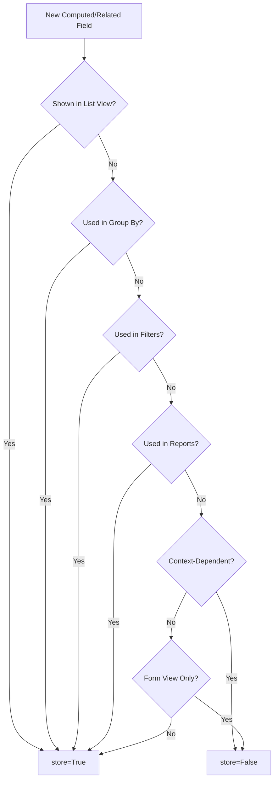

# Decision Matrix

::: tip Quick Reference Guide
This page provides decision matrices for common Odoo configuration choices. Use these tables when you need to quickly determine the right approach for a given scenario.
:::

## Field Type Decision

### Basic Field Types

| If You Need To Store... | Use This Field Type | Example |
| :--- | :--- | :--- |
| Short text (name, reference, email) | `Char` | Customer name, order reference |
| Long text (description, notes) | `Text` | Product description, internal notes |
| Formatted text (HTML emails, descriptions) | `Html` | Email templates, rich descriptions |
| Whole numbers (quantity, count) | `Integer` | Stock quantity, number of employees |
| Decimal numbers (weight, percentage) | `Float` | Weight in kg, discount percentage |
| Money amounts | `Monetary` (with currency field) | Price, total amount |
| Yes/No choice | `Boolean` | Is active, is published |
| Date only | `Date` | Birth date, expiry date |
| Date with time | `Datetime` | Order timestamp, meeting time |
| Fixed list of choices | `Selection` | Status, priority, type |
| File attachment | `Binary` | PDF documents, spreadsheets |
| Image | `Image` | Product photo, company logo |

### Relational Field Types

| If You Need To... | Use This Field Type | Example |
| :--- | :--- | :--- |
| Link to ONE other record | `Many2one` | Order → Customer |
| Show child records (list) | `One2many` | Order → Order Lines |
| Link to MANY other records (tags) | `Many2many` | Product → Categories |
| Display value from linked record | `Related` field | Show customer country on order |
| Calculate value from other fields | `Computed` field | Total = qty × price |

### Special Field Types

| If You Need... | Use This | Notes |
| :--- | :--- | :--- |
| Different values per company | `company_dependent=True` | Product cost varies by company |
| Dynamic custom fields per parent | `Properties` field | Different project task attributes |
| Searchable file content | `Char` + attachment | Store filename, attach file separately |
| JSON/structured data | `Json` field | Flexible structured data |

## Storage Decision

### When to Store Computed/Related Fields

| Scenario | store=True? | Reason |
| :--- | :--- | :--- |
| **Field shown in list views** | ✅ Yes | Avoid N+1 queries |
| **Field used in Group By** | ✅ Yes | Required by database |
| **Field used in filters/search** | ✅ Yes | Better search performance |
| **Field used in reports** | ✅ Yes | Faster report generation |
| **Field only shown on form** | ⚠️ Maybe | Depends on complexity |
| **Value changes frequently** (age, days left) | ❌ No | Would need constant recalculation |
| **Simple display from related record** | ❌ No | Unless needed for reports |
| **Context-dependent value** (stock by location) | ❌ No | Cannot store - value varies |

### Storage Decision Flowchart



## Relationship Decision

### Choosing the Right Relationship Type

| Business Relationship | Technical Field | Example | Notes |
| :--- | :--- | :--- | :--- |
| Record belongs to ONE other | `Many2one` | Order → Customer | Most common relationship |
| Record has MANY children | `One2many` | Order → Order Lines | Inverse of Many2one |
| Record has MANY tags/categories | `Many2many` | Product → Categories | No additional data needed |
| Many-to-many with extra data | Intermediate model | Product ↔ Supplier (with price) | Create linking model |
| Show value from linked record | `Related` field | Customer country on order | Consider storing |

### Many2many vs Intermediate Model

| Question | Many2many | Intermediate Model |
| :--- | :--- | :--- |
| Need extra data on the link? | ❌ No | ✅ Yes |
| Just tagging/categorization? | ✅ Yes | ❌ Overkill |
| Example: Product-Tags | ✅ Perfect | ❌ Unnecessary |
| Example: Product-Supplier (with price) | ❌ Can't store price | ✅ Create product.supplierinfo |

## Widget Decision

### Choosing Display Widgets

| Field Type | Default Widget | Alternative | When to Use Alternative |
| :--- | :--- | :--- | :--- |
| Selection | Dropdown | `radio` | 2-4 options, all visible |
| Selection | Dropdown | `statusbar` | Workflow status in header |
| Selection | Dropdown | `badge` | Status in list view |
| Selection | Dropdown | `priority` | Star-based priority |
| Many2one | Dropdown | `many2one_avatar` | Show image with name |
| Many2one | Dropdown | `many2one_avatar_user` | User assignment |
| Many2many | List | `many2many_tags` | Colorful tags |
| Many2many | List | `many2many_checkboxes` | Small fixed set |
| Float | Number input | `percentage` | Show as % |
| Float | Number input | `progressbar` | Visual progress |
| Char | Text input | `email` | Clickable email |
| Char | Text input | `phone` | Clickable phone |
| Char | Text input | `url` | Clickable link |
| Binary | File upload | `image` | Display as image |
| Text | Multi-line | `html` | Rich text editor |

## Security Decision

### Access Rights vs Record Rules

| Question | Access Rights | Record Rules |
| :--- | :--- | :--- |
| Can user access the model at all? | ✅ | |
| Which records can user see? | | ✅ |
| CRUD permissions | ✅ | |
| Data filtering | | ✅ |
| Performance impact | Low | Higher (evaluated per record) |

### Record Rules vs Domains

| Scenario | Use Record Rule | Use Domain |
| :--- | :--- | :--- |
| Salesperson sees only their leads | ✅ Security | ❌ |
| Default filter shows "Open" items | ❌ | ✅ UX |
| Multi-company data isolation | ✅ Security | ❌ |
| Dropdown shows only active items | ❌ | ✅ Field domain |
| Privacy/legal requirement | ✅ Security | ❌ |
| Helpful default filter | ❌ | ✅ UX |

## Automation Decision

### Choosing the Right Automation Type

| Requirement | Server Action | Scheduled Action | Automated Action |
| :--- | :--- | :--- | :--- |
| User triggers manually | ✅ | ❌ | ❌ |
| Runs at specific time | ❌ | ✅ | ❌ |
| Responds to record changes | ❌ | ❌ | ✅ |
| Batch processing | ❌ | ✅ | ❌ |
| Immediate response needed | ❌ | ❌ | ✅ |
| Daily/weekly reports | ❌ | ✅ | ❌ |
| Lead assignment on create | ❌ | ❌ | ✅ |
| Bulk update selected records | ✅ | ❌ | ❌ |

### Automation Trigger Decision

| When should it trigger? | Use This Trigger |
| :--- | :--- |
| When record is created | On Create |
| When record is updated | On Update |
| When specific field changes | On Update + Trigger Fields |
| When stage/status changes | Stage is set to / State is set to |
| X days before/after a date | Based on date field |
| At regular intervals | Scheduled Action |
| When email is received | On incoming message |
| From external system | On webhook |

## Integration Decision

### Choosing Integration Approach

| Integration Need | Recommended Approach | When to Use |
| :--- | :--- | :--- |
| B2B document exchange | EDI/UBL (Peppol BIS 3) | Sales ↔ Purchase order automation |
| Generate text content | AI Agents with LLM | Marketing, support, content |
| Extract data from documents | AI Digitization (OCR + LLM) | Invoices, receipts, contracts |
| Real-time external sync | XML-RPC / JSON-RPC API | Custom integrations, webhooks |
| Lead scoring | Predictive Lead Scoring (PLS) | Sales pipeline optimization |
| Simple field sync | Automated Actions + Webhook | Low-code external notification |

### API Protocol Decision

| Requirement | XML-RPC | JSON-RPC | REST (custom) |
| :--- | :--- | :--- | :--- |
| Standard Odoo operations | ✅ Native | ✅ Native | Needs controller |
| External system compatibility | Good | Better | Best |
| Performance | Good | Good | Best |
| Ease of use | Moderate | Easy | Depends |
| Binary data handling | Supported | Supported | Native |

## State vs Stage Decision

| Characteristic | Use State (Selection) | Use Stage (Many2one) |
| :--- | :--- | :--- |
| Fixed workflow | ✅ | ❌ |
| Users can customize | ❌ | ✅ |
| Legal/financial process | ✅ | ❌ |
| Sales pipeline | ❌ | ✅ |
| Requires code to change | ✅ | ❌ |
| Each team has different stages | ❌ | ✅ |

## Quick Decision Summary

### "What field type should I use?"

```
Need to link to ONE record? → Many2one
Need to show child records? → One2many
Need multiple tags? → Many2many (or intermediate if extra data)
Need calculated value? → Computed
Need value from linked record? → Related
Fixed choices? → Selection
Yes/No? → Boolean
Money? → Monetary
Everything else? → Char, Text, Integer, Float, Date, Datetime
```

### "Should this field be stored?"

```
In list view? → Store it
In Group By? → Store it
In search/filter? → Store it
In reports? → Store it
Context-dependent? → DON'T store
Only on form? → Probably don't need to store
```

### "Manual action or automatic?"

```
User decides when? → Server Action
At specific times? → Scheduled Action
On record change? → Automated Action
```

## Knowledge Check

::: details Q1: User needs to group orders by customer country. What's needed?
**Answer: A stored related field for country**

Create a stored related field: `partner_country_id = fields.Many2one(related='partner_id.country_id', store=True)`. Non-stored related fields can't be used for Group By.
:::

::: details Q2: Product can have multiple suppliers with different prices. Many2many or intermediate?
**Answer: Intermediate model (product.supplierinfo)**

Many2many can't store additional data like price per supplier. You need an intermediate model with Many2one to both product and supplier, plus price fields.
:::

::: details Q3: Send email when lead is won. Which automation type?
**Answer: Automated Action with "Stage is set to" trigger**

Automated Actions respond to record changes. Use the "Stage is set to" trigger with the Won stage to fire when leads are marked as won.
:::

::: details Q4: Daily report at 9 AM. Which automation type?
**Answer: Scheduled Action**

Scheduled Actions run at specified intervals. Configure to run daily at 9 AM with a Server Action that generates and sends the report.
:::

::: details Q5: Users should only see their own records. Record Rule or Domain?
**Answer: Record Rule**

Security requirements that users should NEVER bypass require Record Rules. Domains are for convenience filtering that users can change.
:::

