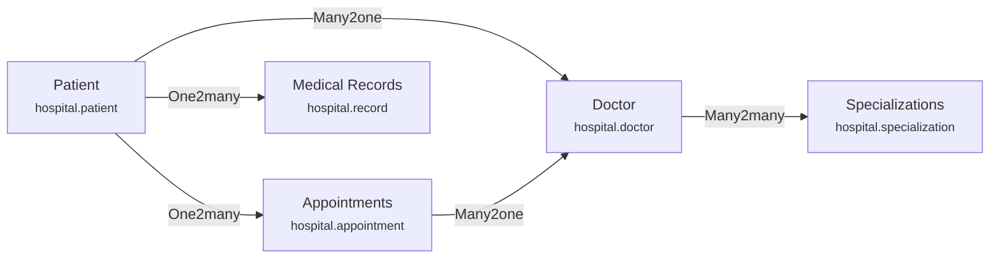
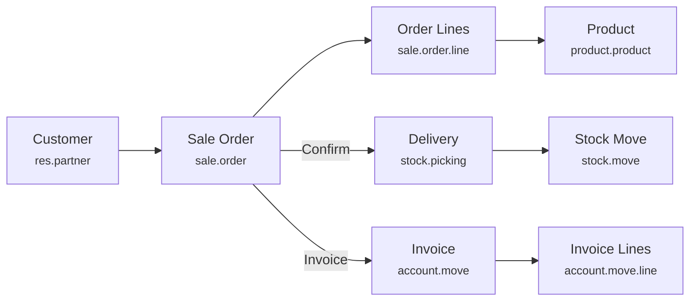
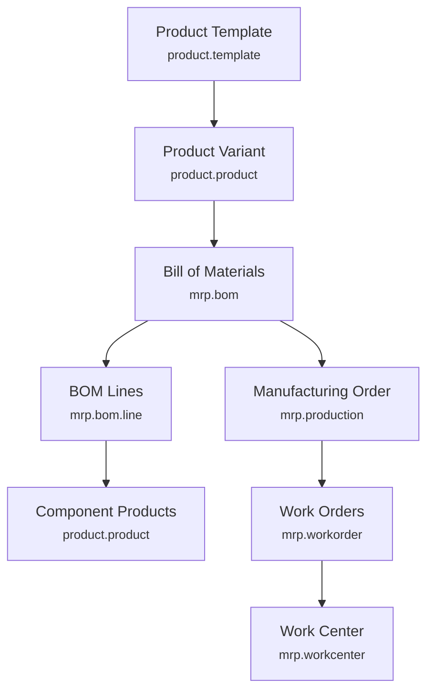
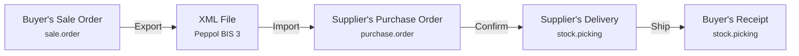
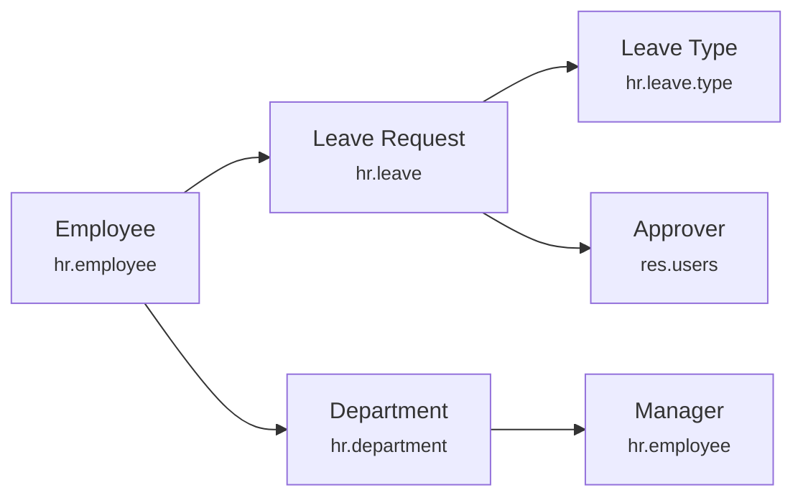
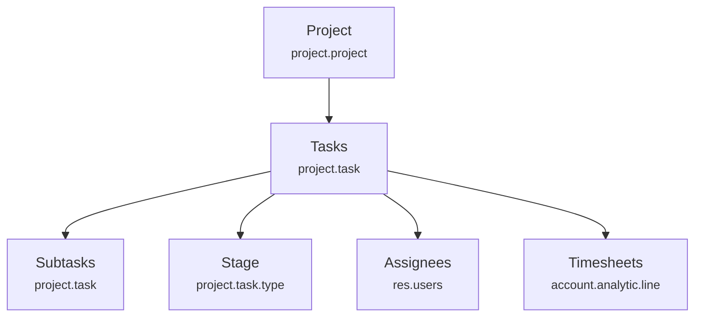
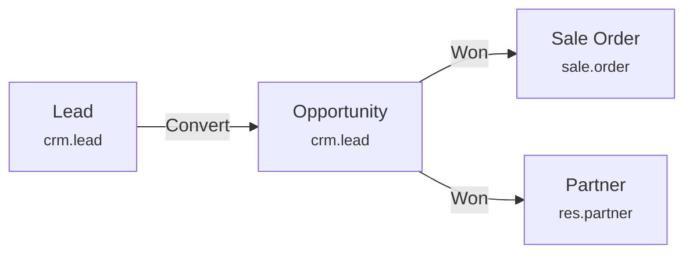

# Real-World Business Examples

::: tip Learning Through Examples
This section provides comprehensive real-world scenarios showing how Odoo's data model concepts apply to actual business cases. Study these to understand how to analyze and design solutions for client requirements.
:::

## Example 1: Hospital Patient Management

::: info Business Requirement
A hospital needs to track patients, their doctors, appointments, and medical records. Each patient is assigned a primary doctor, can have multiple appointments, and needs a complete medical history.
:::

### Data Model



### Model Definitions

| Model | Key Fields | Field Type | Notes |
| :--- | :--- | :--- | :--- |
| **hospital.patient** | `name` | Char (required) | Patient full name |
| | `date_of_birth` | Date | For age calculation |
| | `gender` | Selection [male, female, other] | Medical requirement |
| | `blood_type` | Selection [A+, A-, B+, B-, AB+, AB-, O+, O-] | Emergency info |
| | `doctor_id` | Many2one → hospital.doctor | Primary physician |
| | `appointment_ids` | One2many → hospital.appointment | All appointments |
| | `age` | Integer (computed, not stored) | Calculated from DOB |
| **hospital.doctor** | `name` | Char | Doctor's name |
| | `license_number` | Char | Medical license |
| | `specialization_ids` | Many2many → hospital.specialization | Can have multiple |
| | `patient_ids` | One2many → hospital.patient | Primary patients |
| | `appointment_ids` | One2many → hospital.appointment | All appointments |
| **hospital.appointment** | `patient_id` | Many2one → hospital.patient | Which patient |
| | `doctor_id` | Many2one → hospital.doctor | Which doctor |
| | `appointment_date` | Datetime | When |
| | `state` | Selection [draft, confirmed, in_progress, done, cancelled] | Workflow |
| | `diagnosis` | Text | After consultation |
| | `prescription_ids` | One2many → hospital.prescription | Medications |

### Key Design Decisions

| Requirement | Solution | Why |
| :--- | :--- | :--- |
| Patient can have multiple appointments | One2many on patient | Natural parent-child |
| Doctor has multiple specializations | Many2many | No extra data needed |
| Track appointment workflow | Selection state field | Fixed states, code controls |
| Calculate patient age | Computed field, NOT stored | Changes daily |
| Show doctor's name on appointment list | Related field, stored | Performance in list view |

### Workflow


## Example 2: E-Commerce Order Flow

::: info Business Requirement
Track the complete order lifecycle from quotation through delivery and payment, including inventory management and invoicing.
:::

### Data Flow



### Key Relationships

| From | To | Relationship | Purpose |
| :--- | :--- | :--- | :--- |
| Sale Order | Customer | Many2one | Who is buying |
| Sale Order | Order Lines | One2many | What they're buying |
| Order Line | Product | Many2one | Which product |
| Sale Order | Delivery | One2many | Shipments created |
| Sale Order | Invoice | Many2many | Can have multiple invoices |
| Product | Category | Many2one | For reporting |
| Product | Tags | Many2many | For filtering |

### State Transitions

| Document | States | Key Actions |
| :--- | :--- | :--- |
| **Sale Order** | Draft → Sent → Sale → Done | Confirm creates delivery |
| **Delivery** | Draft → Waiting → Ready → Done | Validate updates stock |
| **Invoice** | Draft → Posted → Paid | Post creates accounting entries |

### Common Computed Fields

| Field | On Model | Formula | Stored? |
| :--- | :--- | :--- | :--- |
| `amount_untaxed` | sale.order | Sum of line subtotals | ✅ Yes |
| `amount_tax` | sale.order | Sum of line taxes | ✅ Yes |
| `amount_total` | sale.order | Untaxed + tax | ✅ Yes |
| `price_subtotal` | sale.order.line | qty × unit_price | ✅ Yes |
| `qty_delivered` | sale.order.line | From stock moves | ✅ Yes |
| `qty_to_deliver` | sale.order.line | qty - delivered | ❌ No (changes) |

## Example 3: Manufacturing Scenario

::: tip Key Manufacturing Relationships
Understanding the manufacturing data model helps when clients need production tracking or MRP implementations.
:::

### Core Manufacturing Objects



### Model Relationships

| Model | Purpose | Key Fields |
| :--- | :--- | :--- |
| **mrp.bom** | Bill of Materials | product_id (what to make), bom_line_ids (components) |
| **mrp.bom.line** | BOM Component | product_id, product_qty, bom_id |
| **mrp.production** | Manufacturing Order | product_id, bom_id, product_qty, state |
| **mrp.workorder** | Work Order Step | production_id, workcenter_id, state, duration |
| **mrp.workcenter** | Work Center | name, capacity, costs_hour |

### Relationship Chain

```
Work Order → Manufacturing Order → Bill of Materials → Product
     ↓
Work Center (where work happens)
```

### Manufacturing Workflow


| State | What Happens |
| :--- | :--- |
| **Draft** | MO created, not yet confirmed |
| **Confirmed** | Components reserved, work orders created |
| **In Progress** | Production started, consuming materials |
| **Done** | Finished product produced, stock updated |

## Example 4: B2B Order Exchange (EDI)

### EDI Order Flow Between Companies



### Document Mapping

| Buyer's Document | EDI Message | Supplier's Document |
| :--- | :--- | :--- |
| Sale Order (to supplier) | Order | Purchase Order |
| - | Order Response | Sale Order Confirmation |
| Purchase Receipt | Despatch Advice | Sale Delivery |
| Purchase Invoice | Invoice | Sale Invoice |

::: info When to Use EDI
- Regular orders between same trading partners
- High-volume B2B transactions
- Compliance with Peppol network requirements
- Reducing manual data entry errors
- Legal requirements (e-invoicing mandates)
:::

## Example 5: HR Leave Management

### Leave Request Flow



### Model Structure

| Model | Key Fields | Purpose |
| :--- | :--- | :--- |
| **hr.leave** | employee_id, holiday_status_id, date_from, date_to, state | The leave request |
| **hr.leave.type** | name, allocation_type, max_days | Types like "Sick", "Vacation" |
| **hr.leave.allocation** | employee_id, holiday_status_id, number_of_days | Leave balance |

### Approval Workflow


### Key Computed Fields

| Field | Computation | Stored? |
| :--- | :--- | :--- |
| `number_of_days` | Business days between dates | ✅ Yes |
| `remaining_leaves` | Allocation - used | ❌ No (dynamic) |
| `can_approve` | User has approval rights | ❌ No (context) |

## Example 6: Project & Task Management

### Project Structure



### Key Features

| Feature | Implementation | Notes |
| :--- | :--- | :--- |
| **Kanban stages** | Many2one to project.task.type | Per-project stages |
| **Task hierarchy** | parent_id Many2one to self | Subtasks |
| **Multiple assignees** | Many2many to res.users | Team assignment |
| **Time tracking** | One2many to analytic.line | Timesheet entries |
| **Properties** | Properties field | Custom fields per project |

### Stage (Not State) Pattern

Projects use **Stages** (Many2one) instead of **States** (Selection):

| Aspect | Project Stages |
| :--- | :--- |
| Customizable | ✅ Each project has different stages |
| Kanban view | ✅ Drag-and-drop between columns |
| Order | ✅ Sequence field for ordering |
| Fold in kanban | ✅ Collapse completed stages |

## Example 7: CRM Pipeline

### Lead to Customer Flow



### CRM Stages

| Stage | Probability | Actions |
| :--- | :--- | :--- |
| New | 10% | Initial contact |
| Qualified | 30% | Need confirmed |
| Proposition | 50% | Quote sent |
| Negotiation | 70% | Discussing terms |
| Won | 100% | Creates customer, order |
| Lost | 0% | Marked with reason |

### Key Fields

| Field | Type | Purpose |
| :--- | :--- | :--- |
| `expected_revenue` | Monetary | Deal value |
| `probability` | Float | Win likelihood (PLS) |
| `stage_id` | Many2one | Pipeline position |
| `user_id` | Many2one | Salesperson |
| `team_id` | Many2one | Sales team |
| `partner_id` | Many2one | Customer (if known) |

## Knowledge Check

::: details Q1: Hospital: Why is patient age NOT stored?
**Answer: It changes every day**

Storing age would require daily recalculation for all patients. Computing on-demand is more efficient since age only needs to be shown, not searched or grouped.
:::

::: details Q2: E-commerce: Why does Sale Order have One2many to deliveries but Many2many to invoices?
**Answer: Multiple invoices can cover multiple orders**

Deliveries are created per-order (one delivery serves one order). But invoices can consolidate multiple orders (one invoice for multiple orders), requiring Many2many.
:::

::: details Q3: Manufacturing: What's the relationship between BOM and Manufacturing Order?
**Answer: BOM is the recipe, MO is the actual production**

Bill of Materials defines HOW to make a product (components, steps). Manufacturing Order is a specific request to make X units using that recipe.
:::

::: details Q4: Project: Why do projects use Stages instead of States?
**Answer: Each project can have different workflow stages**

States are fixed in code. Stages (Many2one records) let each project define its own workflow (e.g., "Design → Review → Done" vs "Backlog → Sprint → Done").
:::

::: details Q5: CRM: How does probability relate to stages?
**Answer: Each stage has a default probability, PLS refines it**

Stages define baseline probability (New=10%, Won=100%). Predictive Lead Scoring (PLS) adjusts based on historical data and lead characteristics.
:::

