# Odoo.sh - The Cloud Platform

::: info What is Odoo.sh?
Odoo.sh is Odoo's official cloud hosting platform. Think of it as a managed environment where your Odoo instance lives, with automatic backups, updates, and professional infrastructure - all handled by Odoo's team.

**Key benefits:** No server management, automatic backups, easy staging, integrated development workflow.
:::

## Why Odoo.sh Matters for Consultants

Understanding Odoo.sh helps you:
- **Communicate with developers** - Know the terminology when discussing deployments
- **Understand project timelines** - Know why testing happens in stages
- **Troubleshoot issues** - Know where to look when something goes wrong
- **Advise clients** - Explain hosting options and their benefits
- **Test configurations** - Use staging to validate changes safely

## The Three Environments

Odoo.sh organizes your project into three distinct environments, like three separate copies of your Odoo:

```mermaid
graph LR
    D[Development<br>🟢 Sandbox] --> S[Staging<br>🟡 Testing]
    S --> P[Production<br>🔴 Live]
```



### 🔴 Production
**The live system where real business happens**

| Aspect | Details |
| :--- | :--- |
| **Users** | Real users work here |
| **Data** | Real business data |
| **Count** | Only ONE production environment |
| **Backups** | Automatic daily backups |
| **Emails** | Sent for real |
| **Scheduled Actions** | Run as configured |
| **Analogy** | The actual store where customers shop |

### 🟡 Staging
**The testing ground with real data**

| Aspect | Details |
| :--- | :--- |
| **Users** | Test users and consultants |
| **Data** | Copy of production data |
| **Count** | Can have multiple staging branches |
| **Backups** | No automatic backups |
| **Emails** | Captured (not sent) - viewable in Mail Catcher |
| **Scheduled Actions** | Disabled by default |
| **Analogy** | A training store with real inventory counts |

### 🟢 Development
**The sandbox for experimentation**

| Aspect | Details |
| :--- | :--- |
| **Users** | Developers only |
| **Data** | Fresh database with demo data each build |
| **Count** | Unlimited development branches |
| **Backups** | None (disposable) |
| **Emails** | Captured |
| **Scheduled Actions** | Disabled |
| **Analogy** | A playground store for training |

## The Deployment Flow


::: info How Changes Move to Production
1. Developer writes code in **Development** branch
2. Code is tested with demo data
3. Promoted to **Staging** with production data copy
4. Final testing with real scenarios
5. Deployed to **Production** when approved

**Why this matters:** New customizations are tested with actual business data (in staging) before going live. This catches problems before they affect real users.
:::

## Development Branches: Testing & Build Status

Every time code is pushed to a development branch, Odoo.sh automatically:

1. Creates a fresh database with demo data
2. Installs all modules from your repository
3. Runs **all automated tests** (thousands of test cases)
4. Marks the build with a status color

### Build Status Indicators

| Status | Meaning | Action Required |
| :--- | :--- | :--- |
| **🟢 Green** | All tests passed | Safe to promote |
| **🟡 Yellow** | Warnings present | Review warnings, may proceed |
| **🔴 Red** | Build failed | Must fix before proceeding |

::: tip Finding Error Details
When a build is yellow or red, check the logs:

1. Go to your Odoo.sh project dashboard
2. Click on the branch with the issue
3. Click the **"Logs"** tab
4. Look for lines with `ERROR` or `WARNING`
5. The log shows exactly which test failed and why

**Tip:** Search for "FAIL" or "Error" in the log to quickly find problems.
:::

## Key Features You Should Know

| Feature | What It Does | Why It Matters |
| :--- | :--- | :--- |
| **Automatic Backups** | Daily backups kept for weeks | Data recovery when things go wrong |
| **Mail Catcher** | Captures emails in staging/dev | Test email workflows safely |
| **One-Click Restore** | Restore any backup instantly | Recover from mistakes quickly |
| **Monitoring Dashboard** | Shows server health | Identify performance issues |
| **Logs** | Detailed activity records | Troubleshoot errors |
| **Shell Access** | Direct server command line | Developers can debug directly |
| **Online Editor** | Edit code in browser | Quick fixes without local setup |
| **GitHub Integration** | Direct link to repository | Seamless code management |

## Shell Access (SSH)

Odoo.sh provides SSH access to your instances, giving you direct command-line access. This is powerful for debugging, data analysis, and advanced operations.

### Connecting to Shell

1. Go to your Odoo.sh project dashboard
2. Select the branch (Production, Staging, or Development)
3. Click the **Shell** tab
4. A terminal opens in your browser

Or connect via SSH client:
```bash
ssh <project>-<branch>-<user>@<project>.odoo.com
```

### Essential Shell Commands

When you connect, you'll see a prompt like:
```
yourproject-main-12345678 [production/17.0]:~$
```

| Command | Description | Example |
| :--- | :--- | :--- |
| `odoo-bin shell` | Open interactive Odoo shell (Python) | Access ORM directly |
| `odoo-update` | Update modules in the database | `odoo-update -m sale,purchase` |
| `odoosh-restart` | Restart Odoo.sh services | After config changes |
| `psql` | Open PostgreSQL database shell | Direct SQL queries |
| `lnav ~/logs/odoo.log` | Navigate logs with search/filter | Debug issues |
| `odoosh-storage` | Check container storage usage | Monitor disk space |

### The Odoo Shell (`odoo-bin shell`)

The Odoo shell gives you interactive Python access to the ORM:

```python
# Connect to the shell
$ odoo-bin shell

# Now you're in a Python environment with 'env' available
>>> partners = env['res.partner'].search([('is_company', '=', True)])
>>> len(partners)
42

>>> # Update records directly
>>> env['res.config.settings'].create({}).execute()

>>> # Run a method on records
>>> so = env['sale.order'].browse(123)
>>> so.action_confirm()

>>> # Commit changes (important!)
>>> env.cr.commit()
```

::: warning Always Commit or Rollback
In the shell, changes aren't automatically saved. Use `env.cr.commit()` to save or `env.cr.rollback()` to discard changes before exiting.
:::

### Updating Modules (`odoo-update`)

```bash
# Update a single module
$ odoo-update -m sale

# Update multiple modules
$ odoo-update -m sale,purchase,stock

# Update all modules (use with caution!)
$ odoo-update --all
```

::: tip When to Use odoo-update
- After a developer updates module code
- When module data files changed
- To recompute stored fields
- **Note:** This runs in the background - check logs for progress
:::

### Database Shell (`psql`)

Direct PostgreSQL access for advanced queries:

```bash
$ psql

# You're now in psql
yourdb=> SELECT id, name FROM res_partner LIMIT 5;
yourdb=> SELECT COUNT(*) FROM sale_order WHERE state = 'sale';
yourdb=> \dt res_*    -- List tables starting with res_
yourdb=> \q          -- Exit psql
```

::: danger Production Database Caution
Direct SQL can bypass Odoo's business logic and break data integrity. Only use for **reading** data in production. For writes, use the Odoo shell instead.
:::

### Log Navigation (`lnav`)

The `lnav` tool makes reading logs much easier than `tail` or `cat`:

```bash
$ lnav ~/logs/odoo.log
```

**Inside lnav:**
| Key | Action |
| :--- | :--- |
| `/` | Search for text |
| `n` / `N` | Next/previous match |
| `e` / `E` | Jump to next/previous error |
| `w` / `W` | Jump to next/previous warning |
| `g` / `G` | Go to top/bottom |
| `q` | Quit |

::: tip Quick Error Finding
Press `e` to jump directly to the next ERROR line. Much faster than scrolling through thousands of log lines!
:::

### Storage Management (`odoosh-storage`)

Check how much disk space your instance is using:

```bash
$ odoosh-storage

Container filesystem usage:
  Used: 2.1 GB / 10 GB (21%)

Breakdown:
  /home/odoo/data/filestore: 1.8 GB
  /home/odoo/logs: 245 MB
  /home/odoo/src: 89 MB
```

If storage is full, common culprits are:
- Large attachments in filestore
- Accumulated log files
- Temporary files from failed imports

### Other Useful Commands

```bash
# View environment info
$ env | grep ODOO

# Check Python packages
$ pip list | grep odoo

# View running processes
$ ps aux | grep odoo

# Check memory usage
$ free -h

# View disk space
$ df -h

# Find large files
$ find ~/data -size +100M -exec ls -lh {} \;
```

### Dedicated Hosting Only: SQL External Access

For dedicated hosting plans, you can enable **read-only** external PostgreSQL access for BI tools:

```bash
$ odoosh-sql-access <command>
```

| Command | Description |
| :--- | :--- |
| `status` | Display current status and connected clients |
| `init` | Initialize external access and generate password |
| `reset` | Reset the external access password |
| `disable` | Disable external access (clears password) |
| `kill` | Force-kill all existing external connections |

**Setting up external access:**
```bash
$ odoosh-sql-access init
# Returns connection details: host, port, database, user, password
```

::: warning Limitations
- **Read-only access** - Cannot modify data
- **Dedicated hosting only** - Not available on shared plans
- **SSL required** - Client must support SSL connections
- **Incompatible clients** - PgAdmin and Qlik Sense don't work
- **May disconnect** - Platform updates can interrupt connections

**Compatible tools:** DBeaver, Metabase, Tableau, Power BI, custom scripts
:::

## Understanding Builds

Every time code is pushed to Odoo.sh, a "build" happens.

### What Happens During a Build

```mermaid
graph TD
    P[Push Code] --> C[Clone Repository]
    C --> I[Install Dependencies]
    I --> M[Install/Update Modules]
    M --> T[Run Tests]
    T --> R{Tests Pass?}
    R -->|Yes| G[🟢 Green Build]
    R -->|No| F[🔴 Red Build]
```



::: info Build Safety
If a build fails, the previous working version continues running. Your production never goes down due to a bad update.
:::

### Build Types

| Build Type | Triggered By | Database |
| :--- | :--- | :--- |
| **Development** | Push to dev branch | Fresh with demo data |
| **Staging** | Push or merge to staging | Copy of production |
| **Production** | Push or merge to main | Uses existing production DB |

## Backup Strategy

Odoo.sh automatically maintains backups across three data centers:

| Backup Type | Retention | Use Case |
| :--- | :--- | :--- |
| **7 daily backups** | Last 7 days | Recent recovery |
| **4 weekly backups** | Last 4 weeks | Short-term history |
| **3 monthly backups** | Last 3 months | Long-term recovery |

Each backup includes:
- Database (all records)
- Attachments (files, images)
- Logs

### Restoring from Backup

1. Go to Odoo.sh project dashboard
2. Select **Backups** tab
3. Choose the backup to restore
4. Select target branch (usually staging first)
5. Confirm restoration

::: warning Test Restores in Staging
Always test a backup restoration in staging before production. Verify critical data is intact.
:::

## Upgrade Process


::: warning How Version Upgrades Work
When upgrading Odoo versions (e.g., 17 → 18 → 19):

1. Odoo.sh takes your latest production backup
2. Sends it to Odoo's upgrade platform
3. Returns an upgraded database to a staging branch
4. You test the upgraded version thoroughly
5. When ready, deploy to production

**Important:** Custom modules need separate updates by developers to work with the new version.
:::

## Staging vs Production: Key Differences

| Aspect | Staging | Production |
| :--- | :--- | :--- |
| **Emails** | Captured (Mail Catcher) | Actually sent |
| **Scheduled Actions** | Disabled by default | Run as configured |
| **Data** | Copy of production | Real, live data |
| **Automatic Backups** | No | Yes (daily) |
| **Payment Gateways** | Test mode | Live transactions |
| **External APIs** | May use sandbox | Live endpoints |

## Common Odoo.sh Terms

| Term | Meaning |
| :--- | :--- |
| **Branch** | A version of your code (like a separate copy) |
| **Build** | The process of deploying code changes |
| **Merge** | Combining code from one branch into another |
| **Push** | Sending code changes to Odoo.sh |
| **Repository** | Where all the code is stored (on GitHub) |
| **Commit** | A saved set of code changes |
| **Neutralized** | Staging database with emails/actions disabled |
| **Worker** | Server process handling requests |
| **Cron** | Background process for scheduled actions |

## What Consultants Should Know

### Your Role with Odoo.sh

::: tip Testing Responsibilities
- **When developers say "it's on staging"** - Log in and test with real scenarios
- **Reporting Issues** - Note exact steps, time, and error messages
- **Configuration Changes** - Remember they don't auto-transfer between environments
- **Timing** - Complex changes need full dev → staging → production cycle
:::

### The Configuration Problem

::: warning Common Misconception
**Wrong:** "I configured everything perfectly in staging, so production will have it too."

**Right:** Only *code changes* move between branches. Database changes (records, settings, Studio customizations) must be either:
1. Reconfigured manually in production, OR
2. Written as data files by developers to deploy automatically
:::

### What Transfers vs What Doesn't

| Transfers Automatically | Must Be Reconfigured |
| :--- | :--- |
| Code changes | User settings |
| Data files (XML) | Manual configurations |
| Module updates | System parameters (some) |
| New fields | Studio customizations |
| View changes | Automated action settings |
| Report templates | Email templates content |

## Troubleshooting Guide

### Common Issues

| Issue | Possible Cause | Solution |
| :--- | :--- | :--- |
| Build failed | Test errors | Check logs for specific failures |
| Slow performance | Resource limits | Check monitoring, optimize queries |
| Emails not sending | Wrong environment | Verify you're in production |
| Module not found | Not in repository | Check requirements.txt |
| Database locked | Long-running operation | Wait or contact support |

### Getting Help

1. **Logs first** - Always check logs before asking for help
2. **Odoo.sh Support** - Use the support button in dashboard
3. **Community Forum** - For general questions
4. **GitHub Issues** - For bugs in Odoo code

## Best Practices

### For Consultants

1. **Always test in staging** before production changes
2. **Document everything** - What was changed and why
3. **Communicate with developers** - Use proper terminology
4. **Check build status** - Don't use red/yellow builds
5. **Know the timeline** - Deployments take time

### For Project Success

1. **Regular staging refreshes** - Keep staging data current
2. **Test with real data** - Catch edge cases
3. **Plan deployments** - Schedule during low-usage periods
4. **Monitor after deployment** - Watch for issues
5. **Keep backups** - Never skip backup verification

## Knowledge Check

::: details Q1: Why is staging data not automatically kept in sync with production?
**Answer: Staging is for testing, not production mirroring**

Staging gets a copy of production at specific points (when promoted or refreshed). This isolation allows testing without affecting real data. Changes tested in staging don't accidentally corrupt production.
:::

::: details Q2: An email automation works in staging but not production. Why?
**Answer: Staging emails are captured, not sent**

In staging, emails go to Mail Catcher for review. In production, they actually send. If not sending in production, check email server configuration and that automation is properly deployed.
:::

::: details Q3: Configuration done in staging doesn't appear in production. What went wrong?
**Answer: Database changes don't transfer - only code does**

Settings, configurations, and Studio changes are in the database. Only code (Python, XML data files) transfers between branches. Either reconfigure in production or ask developers to add it as data files.
:::

::: details Q4: What does a yellow build mean?
**Answer: Tests passed but with warnings**

The code works but has issues like deprecated functions, missing translations, or style warnings. It may proceed but should be reviewed. Yellow is acceptable but not ideal.
:::

::: details Q5: How do you safely test a production backup restore?
**Answer: Restore to staging first**

Never test restores directly in production. Create a staging branch, restore the backup there, verify data integrity, then if needed restore to production.
:::

