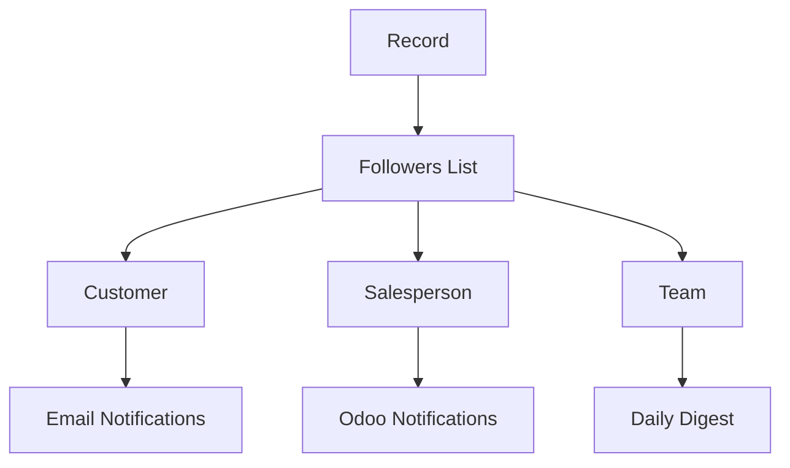

# Chatter, Followers & Activities

::: info What is the Chatter?
The Chatter is the message log and communication hub that appears at the bottom of many Odoo records. It tracks all changes, messages, and activities related to that record - like a built-in timeline and communication center.

**Key purpose:** Keep all communication and history in one place, attached to the relevant record.
:::

## Where You'll See the Chatter

The Chatter appears on records that need collaboration or history tracking:

| Module | Records with Chatter | Primary Use |
| :--- | :--- | :--- |
| **Sales** | Orders, Quotations | Customer communications |
| **Accounting** | Invoices, Payments | Payment reminders, notes |
| **CRM** | Leads, Opportunities | Sales team discussions |
| **Project** | Projects, Tasks | Team collaboration |
| **Helpdesk** | Tickets | Customer support threads |
| **Purchase** | Orders | Vendor communications |
| **HR** | Employees, Applications | Internal HR notes |
| **Inventory** | Transfers | Warehouse notes |

## The Chatter Interface

```
┌─────────────────────────────────────────────────────────────────┐
│  [Send message] [Log note] [Schedule activity]                   │
├─────────────────────────────────────────────────────────────────┤
│  📧 Message to Customer                          Today 10:30 AM  │
│  From: Sarah (Sales Rep)                                         │
│  "Thank you for your order! Delivery scheduled for Friday."      │
├─────────────────────────────────────────────────────────────────┤
│  📝 Internal Note                               Yesterday 4:15 PM│
│  From: Manager                                                   │
│  "Customer called - needs express delivery. Priority!"           │
├─────────────────────────────────────────────────────────────────┤
│  🔄 Status Changed                              Yesterday 2:00 PM│
│  Stage: Draft → Sent                                             │
├─────────────────────────────────────────────────────────────────┤
│  👥 Followers: Customer (john@acme.com), Sarah, Warehouse Team   │
└─────────────────────────────────────────────────────────────────┘
```

## The Three Parts of Chatter

### 1. Messages
The communication thread attached to the record.

| Message Type | Icon | Who Sees It | Use Case |
| :--- | :--- | :--- | :--- |
| **Send Message** | 📧 | All followers (may send email) | External communication |
| **Log Note** | 📝 | Internal users only | Team discussions, private notes |
| **System Message** | 🔄 | All followers | Automatic status changes |

### 2. Activities
Scheduled tasks and follow-ups linked to the record.

| Activity Type | Common Use |
| :--- | :--- |
| **To Do** | General tasks: "Review contract" |
| **Call** | Phone follow-ups |
| **Meeting** | Calendar appointments |
| **Email** | Email reminders |
| **Upload Document** | Document tasks |

### 3. Followers
People who receive notifications about the record.

| Follower Type | How They're Added |
| :--- | :--- |
| **Automatic** | Assigned salesperson, customer |
| **Manual** | Click "Add Followers" |
| **By Mention** | @mentioned in message |

## Understanding Message Types

### Log Note vs Send Message

::: warning Critical Difference
| Aspect | Log Note | Send Message |
| :--- | :--- | :--- |
| **Recipients** | Internal users only | All followers (including customers!) |
| **Email sent?** | Never | Yes (if recipients have email notification) |
| **Visibility** | Private to team | Visible to followers |
| **Use for** | Internal discussions | Customer communication |

**Golden Rule:** Check the recipient list before clicking "Send". Customers might be followers!
:::

### When to Use Each

| Scenario | Use Log Note | Use Send Message |
| :--- | :--- | :--- |
| Internal reminder | ✅ | ❌ |
| Customer question | ❌ | ✅ |
| Team discussion | ✅ | ❌ |
| Status update to client | ❌ | ✅ |
| Note about customer behavior | ✅ | ❌ |
| Follow-up on order | ❌ | ✅ |

### System Messages

System messages are generated automatically when tracked fields change:

```
🔄 Stage changed from "New" to "Qualified"
🔄 Assigned to: Sarah → John
🔄 Expected Revenue changed from $10,000 to $15,000
```

These create an audit trail without manual effort.

## Understanding Followers

### How Someone Becomes a Follower

| Method | Example |
| :--- | :--- |
| **Automatic** | Salesperson assigned, customer on order |
| **Manual** | Click "Add Followers" button |
| **By Mention** | Type @username in message |
| **Subscription** | User subscribes to a channel |

### Follower Subscription Types

| Type | What They Receive |
| :--- | :--- |
| **All Messages** | Every update, every message |
| **Comments Only** | Direct messages, not system logs |
| **Not Following** | No notifications (but can still view) |

### Managing Followers



::: tip Best Practice
Regularly review followers on sensitive records. Remove unnecessary followers to prevent information leakage.
:::

## Activities: Scheduling Follow-ups

### Activity Basics

Activities are scheduled tasks linked to a specific record. They appear in:
- The record's chatter
- The user's activity view
- The calendar (if applicable)

### Activity Types

| Type | Icon | When to Use |
| :--- | :--- | :--- |
| **To Do** | ☑️ | General tasks |
| **Call** | 📞 | Phone follow-ups |
| **Meeting** | 📅 | Scheduled meetings |
| **Email** | ✉️ | Email reminders |
| **Upload Document** | 📄 | Document tasks |
| **Request Signature** | ✍️ | Signature requests |

### Activity Due Date Colors

| Color | Meaning | Action |
| :--- | :--- | :--- |
| **Green** | Due in the future | On track |
| **Orange** | Due today | Needs attention |
| **Red** | Overdue | Immediate action required |

### Creating Effective Activities

::: tip Activity Best Practices
1. **Be specific** - "Call John about renewal" not "Follow up"
2. **Set realistic deadlines** - Don't schedule everything for "today"
3. **Assign to the right person** - Activities can be assigned to others
4. **Use summaries** - Add notes about what to discuss
5. **Mark done promptly** - Keep your activity list clean
:::

## Tracking Field Changes

### How Tracking Works

Fields with `tracking=True` automatically log changes to the chatter.

```python
# Python field definition
state = fields.Selection([...], tracking=True)
user_id = fields.Many2one('res.users', tracking=True)
expected_revenue = fields.Monetary(tracking=True)
```

### Common Tracked Fields

| Field | What Gets Logged |
| :--- | :--- |
| **Status/Stage** | "Stage changed from 'New' to 'Qualified'" |
| **Assigned User** | "Salesperson changed from John to Sarah" |
| **Expected Revenue** | "Expected Revenue: $10,000 → $15,000" |
| **Priority** | "Priority: Normal → Urgent" |
| **Due Date** | "Due Date: Jan 15 → Jan 20" |

### Audit Trail Value

::: info Why Tracking Matters
Tracking creates automatic documentation of:
- **Who** changed what
- **When** changes occurred
- **What** the values were before and after

This is invaluable for:
- Compliance and auditing
- Understanding record history
- Troubleshooting issues
- Performance reviews
:::

## Using @Mentions

### How @Mentions Work

Type `@` followed by a name to:
1. Notify the mentioned person
2. Automatically add them as a follower
3. Highlight the mention in the message

### @Mention Best Practices

| Do | Don't |
| :--- | :--- |
| @mention specific people for action items | @mention everyone unnecessarily |
| Use for questions that need answers | Use for general FYI messages |
| Follow up if no response | Assume mention = task accepted |

## Practical Tips

### For Efficient Communication

1. **Use @mentions** - Notify specific people for action items
2. **Attach files** - Click paperclip to add documents
3. **Log notes for context** - Help future users understand history
4. **Schedule activities** - Don't rely on memory
5. **Check followers before sending** - Know who will receive messages

### For Record Management

1. **Review history first** - Check chatter when taking over a record
2. **Document decisions** - Log why changes were made
3. **Track important fields** - Enable tracking on key business data
4. **Clean up followers** - Remove irrelevant followers periodically

### Common Chatter Patterns

| Situation | Pattern |
| :--- | :--- |
| Handoff to colleague | Log note with context + @mention new owner |
| Customer complaint | Log note about complaint + Send message acknowledging |
| Approval request | Schedule activity for approver |
| Status update | Tracking handles this automatically |
| Meeting follow-up | Log note with key points + activities for action items |

## Email Integration

### Incoming Emails

When configured, emails sent to Odoo aliases become chatter messages:

```
Customer sends email to sales@company.odoo.com
→ Email appears as message on the order/lead
→ Followers are notified
→ Reply creates new message
```

### Outgoing Emails

Messages marked "Send Message" can trigger emails:
- Depends on follower notification preferences
- Templates can format the email
- Attachments are included

### Email Aliases

| Record Type | Typical Alias | Use |
| :--- | :--- | :--- |
| Sales Leads | leads@company.odoo.com | Create new leads |
| Support Tickets | support@company.odoo.com | Create tickets |
| Project Tasks | project+123@company.odoo.com | Add to project |

## Automation with Chatter

### Automated Actions and Chatter

You can automate chatter messages:

1. **On status change** - Send notification when order confirmed
2. **On assignment** - Notify assignee via chatter
3. **On creation** - Welcome message to customer
4. **On deadline** - Reminder activities

### Example: Automated Notifications

| Trigger | Action | Message Type |
| :--- | :--- | :--- |
| Order confirmed | Notify warehouse | Log Note |
| Invoice overdue | Notify customer | Send Message |
| Task assigned | Notify assignee | Log Note |
| Lead won | Congratulate team | Log Note |

## Troubleshooting Chatter

### Common Issues

| Issue | Cause | Solution |
| :--- | :--- | :--- |
| Customer received internal note | Used "Send Message" not "Log Note" | Double-check message type |
| No notifications received | User preference set to "Never" | Check notification settings |
| Emails not sending | Mail server misconfigured | Check outgoing mail settings |
| Can't see chatter | Model doesn't inherit mail.thread | Technical - needs development |
| Missing tracking messages | Field doesn't have tracking=True | Technical - needs development |

## Knowledge Check

::: details Q1: You need to make a note about a difficult customer conversation. Log Note or Send Message?
**Answer: Log Note**

Log Notes are internal only - the customer will never see them. Use Log Note for any internal commentary, especially sensitive observations.
:::

::: details Q2: How do you ensure someone sees an important message?
**Answer: Use @mention**

@mentioning someone notifies them directly and adds them as a follower. It's the most reliable way to get someone's attention on a specific record.
:::

::: details Q3: Customer complaint: "I never received any updates!" but chatter shows messages. What happened?
**Answer: Customer might not be a follower, or notifications are off**

Check if the customer is in the followers list and their notification preferences. They may have been removed as a follower or have email notifications disabled.
:::

::: details Q4: How can you automatically track who changed a field and when?
**Answer: Add tracking=True to the field definition**

Fields with `tracking=True` automatically log all changes to the chatter, including who made the change, when, and the before/after values.
:::

::: details Q5: Activity is red. What does that mean?
**Answer: The activity is overdue**

Red = overdue (past due date), Orange = due today, Green = due in the future. Red activities need immediate attention.
:::

