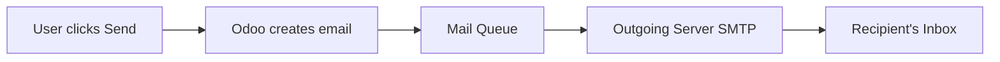
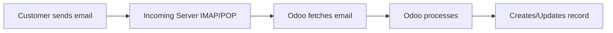
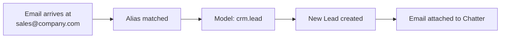

# Email in Odoo

::: info How Email Works in Odoo
Odoo can both send and receive emails. Outgoing emails deliver invoices, quotes, and notifications. Incoming emails can create leads, tickets, or update existing records. Email is deeply integrated with the Chatter system for seamless communication tracking.
:::

## Email Flow Overview

### Outgoing Emails

### Incoming Emails

## Email Configuration

### Outgoing Mail Server (SMTP)

| Setting | Description | Example |
| :--- | :--- | :--- |
| **SMTP Server** | Mail server address | smtp.gmail.com |
| **SMTP Port** | Server port | 587 (TLS) or 465 (SSL) |
| **Connection Security** | Encryption type | TLS (Recommended) |
| **Username** | SMTP account | noreply@company.com |
| **Password** | SMTP password | App-specific password |

**Location:** Settings → Technical → Email → Outgoing Mail Servers

::: warning Gmail/Google Workspace
For Gmail, use an **App Password** instead of your regular password:
1. Enable 2-Factor Authentication on Google account
2. Go to Security → App Passwords
3. Generate password for "Mail" on "Other"
4. Use this 16-character password in Odoo
:::

### Incoming Mail Server (IMAP/POP)

| Setting | Description | Example |
| :--- | :--- | :--- |
| **Server Type** | IMAP (recommended) or POP | IMAP |
| **Server Name** | Mail server address | imap.gmail.com |
| **Port** | Server port | 993 (SSL) |
| **Username** | Email account | sales@company.com |
| **Password** | Account password | App-specific password |

**Location:** Settings → Technical → Email → Incoming Mail Servers

## Common Email Features

| Feature | What It Does | Example |
| :--- | :--- | :--- |
| **Email Templates** | Pre-written emails with dynamic placeholders | Invoice reminder that auto-fills customer name and amount |
| **Email Alias** | Auto-create records from emails to specific addresses | sales@company.com creates new CRM leads |
| **Mail Gateway** | Route incoming emails to correct records | Reply to invoice email updates that invoice's chatter |
| **Scheduled Emails** | Queue emails to send later | Send newsletter at 9 AM tomorrow |
| **Mass Mailing** | Send to many recipients | Marketing campaigns |
| **Email Tracking** | Track opens and clicks | Know when customer reads email |

## Email Aliases

Aliases automatically create records when emails arrive at specific addresses.

### How Aliases Work

### Common Aliases

| Alias | Creates | Module |
| :--- | :--- | :--- |
| `sales@yourcompany.com` | CRM Lead | CRM |
| `support@yourcompany.com` | Helpdesk Ticket | Helpdesk |
| `jobs@yourcompany.com` | HR Application | Recruitment |
| `info@yourcompany.com` | Lead or Message | CRM |
| `purchase@yourcompany.com` | RFQ/Vendor Bill | Purchase |

### Setting Up Aliases

1. Go to the module settings (e.g., CRM → Configuration)
2. Find the **Alias** section
3. Set the alias prefix (e.g., "sales")
4. Configure the domain in Settings → Technical → Parameters

::: tip Catchall Alias
The **catchall alias** (configured in Settings → Technical → Alias Domain) routes replies to existing records. When someone replies to an Odoo email, the catchall matches it to the original record.
:::

## Email Templates

Templates save time by pre-filling common emails with dynamic data.

### Template Structure

| Component | Purpose | Example |
| :--- | :--- | :--- |
| **Subject** | Email subject line | "Invoice {{ object.name }} - {{ object.partner_id.name }}" |
| **Body** | Email content | Dynamic HTML with placeholders |
| **From** | Sender address | Can be fixed or dynamic |
| **Reply-To** | Where replies go | Usually catchall or specific |
| **Attachments** | Files to include | Reports, documents |

### Dynamic Placeholders (Jinja2/QWeb)

Templates use placeholders that get replaced with real data:

| Placeholder | Resolves To | Example Result |
| :--- | :--- | :--- |
| `{{ object.partner_id.name }}` | Customer's name | "Acme Corp" |
| `{{ object.amount_total }}` | Invoice total | "$1,500.00" |
| `{{ object.date_order }}` | Order date | "2024-12-15" |
| `{{ object.user_id.name }}` | Assigned salesperson | "Sarah Johnson" |
| `{{ object.company_id.name }}` | Company name | "My Company" |
| `{{ object.name }}` | Record reference | "SO/2024/001" |

**Location:** Settings → Technical → Email → Email Templates

### Creating a Template

1. Go to Settings → Technical → Email → Email Templates
2. Click **Create**
3. Set **Name** (internal reference)
4. Select **Applies to** (model: sale.order, account.move, etc.)
5. Design **Subject** and **Body** with placeholders
6. Test with **Preview** button

### Common Template Types

| Template | Applies To | Trigger |
| :--- | :--- | :--- |
| Quotation Sent | sale.order | Send Quotation button |
| Invoice Reminder | account.move | Automated action or manual |
| Order Confirmation | sale.order | Order confirmed |
| Delivery Notification | stock.picking | Delivery validated |
| Welcome Email | res.partner | Contact created |

## Email Actions

### Sending Emails Manually

1. Open the record (order, invoice, etc.)
2. Click **Send by Email** or **Send & Print**
3. Review/edit the pre-filled template
4. Click **Send**

### Automated Email Sending

Use **Automated Actions** to send emails automatically:

| Trigger | Action | Example |
| :--- | :--- | :--- |
| On Create | Send Email | Welcome email for new contacts |
| On Update (state change) | Send Email | Confirmation when order confirmed |
| Based on date | Send Email | Reminder 3 days before deadline |
| Scheduled | Send Email | Weekly summary every Monday |

## Mail Queue

Emails don't send immediately - they go to a queue processed by a scheduled action.

### Queue Status

| Status | Meaning | Action |
| :--- | :--- | :--- |
| **Outgoing** | Waiting to be sent | Will send on next cron run |
| **Sent** | Successfully delivered to SMTP | Done |
| **Exception** | Failed to send | Check error, retry |
| **Cancelled** | Manually cancelled | Won't send |

**Location:** Settings → Technical → Email → Emails

### Force Send

To send queued emails immediately:
1. Go to Settings → Technical → Automation → Scheduled Actions
2. Find **Mail: Email Queue Manager**
3. Click **Run Manually**

## Troubleshooting Email Issues

### Common Problems

| Problem | Possible Cause | Solution |
| :--- | :--- | :--- |
| **Emails not sending** | Outgoing server misconfigured | Check SMTP settings, test connection |
| **Emails in outbox stuck** | Scheduled action not running | Run mail queue manually |
| **Customer not receiving** | Spam filters, wrong email address | Check contact's email, ask to check spam |
| **Incoming emails not creating records** | Alias not configured | Set up alias in module settings |
| **Replies not linking to records** | Catchall not configured | Configure catchall alias |
| **Authentication failed** | Wrong password | Use app-specific password |
| **SSL/TLS error** | Wrong port or security setting | Match port to security type |

### Debugging Steps

1. **Check outgoing server:**
   - Settings → Technical → Outgoing Mail Servers
   - Click **Test Connection**

2. **Check mail queue:**
   - Settings → Technical → Email → Emails
   - Look for failed emails with error messages

3. **Check scheduled actions:**
   - Settings → Technical → Automation → Scheduled Actions
   - Find "Mail: Email Queue Manager"
   - Check Last Execution and Next Execution

4. **Check server logs:**
   - Look for SMTP connection errors
   - Authentication failures

### Email Validation

| Check | Where | What to Verify |
| :--- | :--- | :--- |
| SPF record | DNS | Authorize Odoo's server to send |
| DKIM | DNS + Server | Sign emails cryptographically |
| DMARC | DNS | Policy for handling failures |
| Reverse DNS | Server | IP resolves to domain |

## Mass Mailing

### Email Marketing Module

For marketing campaigns, use the **Email Marketing** module:

| Feature | Description |
| :--- | :--- |
| **Mailing Lists** | Manage subscriber lists |
| **Campaigns** | Group related mailings |
| **A/B Testing** | Test subject lines |
| **Templates** | Drag-and-drop email builder |
| **Statistics** | Opens, clicks, bounces |
| **Automation** | Triggered email sequences |

### Mass Mailing vs Transactional Email

| Aspect | Mass Mailing | Transactional Email |
| :--- | :--- | :--- |
| **Purpose** | Marketing, newsletters | Order confirmations, invoices |
| **Recipients** | Many (mailing list) | One (specific contact) |
| **Unsubscribe** | Required | Not applicable |
| **Template** | Marketing-focused | Document-focused |
| **Tracking** | Opens, clicks | Delivery status |

## Email Best Practices

### For Consultants

1. **Test templates** - Always preview before enabling
2. **Check spam score** - Avoid spam trigger words
3. **Verify sender** - Use authenticated domain
4. **Monitor queue** - Check for stuck emails regularly
5. **Document aliases** - Keep list of configured aliases

### For Deliverability

1. **Use custom domain** - Not generic Gmail
2. **Configure SPF/DKIM** - Authenticate your domain
3. **Warm up IP** - Gradually increase sending volume
4. **Clean lists** - Remove bounced emails
5. **Respect opt-outs** - Honor unsubscribe requests

## Knowledge Check

::: details Q1: Emails are stuck in the outbox and not sending. What should you check first?
**Answer: Check if the Mail Queue scheduled action is running**

Go to Settings → Technical → Automation → Scheduled Actions. Find "Mail: Email Queue Manager" and verify it's active and running. You can click "Run Manually" to force processing.
:::

::: details Q2: Customer replies to an invoice email but it doesn't appear on the invoice. Why?
**Answer: Catchall alias is not configured or not matching**

The catchall alias routes replies to the correct records. Check Settings → Technical → Parameters → Alias Domain, and ensure the catchall is properly configured and the email format matches.
:::

::: details Q3: How do you create a new CRM lead from incoming emails?
**Answer: Configure an email alias for the CRM module**

Go to CRM → Configuration → Settings. Set up an alias (e.g., "sales"). Emails sent to sales@yourdomain.com will automatically create new leads.
:::

::: details Q4: What's the difference between Send Message and Log Note for email?
**Answer: Send Message can trigger emails to followers; Log Note never sends emails**

Send Message may send actual emails to followers (depending on their notification preferences). Log Note is purely internal and never generates outgoing email.
:::

::: details Q5: Gmail authentication keeps failing even with the correct password. What's wrong?
**Answer: You need to use an App Password, not your regular Gmail password**

Gmail requires App Passwords for "less secure apps" like Odoo. Enable 2FA on your Google account, then generate an App Password specifically for Odoo.
:::

