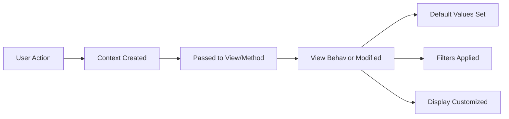

# Context - The Hidden Parameter

::: tip The Mystery of the Pre-Filled Form
You click "Create Invoice" from a Sales Order, and the form already has the customer, products, and amounts filled in. Magic? No - it's **context**.

You navigate to Contacts from a Sales Team and only see contacts for that team. How does it know? **Context**.

Context is the invisible messenger that carries information between screens in Odoo. Understanding it helps you troubleshoot "why is this pre-filled?" and "why can't I see my record?"
:::

## What is Context?

::: info Definition
Context is a **Python dictionary** of key-value pairs that travels with every action in Odoo. It tells views and actions how to behave, what defaults to set, and how to filter data. Think of it as instructions whispered behind the scenes.
:::

### Context Flow



## What Context Controls

### Common Context Keys

| Context Key | What It Does | Example |
| :--- | :--- | :--- |
| `default_*` | Pre-fills fields when creating | `default_partner_id: 5` pre-selects customer ID 5 |
| `search_default_*` | Activates search filter automatically | `search_default_my_tasks: 1` shows only your tasks |
| `group_by` | Groups records by a field | `group_by: stage_id` groups by stage |
| `active_test` | Controls archived records visibility | `active_test: False` shows archived records too |
| `lang` | Sets language for translations | `lang: 'fr_FR'` shows French translations |
| `tz` | Sets timezone | `tz: 'Europe/Paris'` for time display |
| `uid` | Current user ID | Used internally |
| `allowed_company_ids` | Multi-company access | Which companies user can access |

### Default Values (default_*)

The `default_` prefix pre-fills fields when creating new records:

```python
# Context on "Create Order" button
{
    'default_partner_id': 42,      # Customer pre-selected
    'default_team_id': 3,          # Sales team assigned
    'default_user_id': 15,         # Salesperson assigned
    'default_date_order': '2024-12-15',  # Date pre-filled
}
```

### Search Filters (search_default_*)

The `search_default_` prefix activates predefined search filters:

```python
# Context on "My Tasks" menu item
{
    'search_default_my_tasks': 1,    # Activates "My Tasks" filter
    'search_default_open': 1,        # Activates "Open" filter
}
```

::: warning Filter Activation
The value `1` (or any truthy value) activates the filter. The filter name must match a `<filter>` element's `name` attribute in the search view XML.
:::

## Where You See Context in Action

### Smart Buttons

When you click a smart button, context filters related records:

```python
# "Invoices" button on customer form
{
    'search_default_partner_id': 42,  # Filter invoices for this customer
    'default_partner_id': 42,         # New invoices get this customer
}
```

**Result:** You see only that customer's invoices, and creating new ones pre-fills the customer.

### Menu Items

Menu items can include context to customize the view:

```python
# "My Quotations" menu item
{
    'search_default_my_quotations': 1,  # Only show my quotes
    'search_default_draft': 1,          # Only show drafts
}
```

### Kanban Views

Kanban views use context for grouping:

```python
# CRM Pipeline view
{
    'group_by': 'stage_id',           # Group by stage
    'default_type': 'opportunity',    # New records are opportunities
}
```

### Create Buttons

"New" buttons pass context to pre-fill the form:

```python
# "New Task" button in a project
{
    'default_project_id': 15,         # Link task to this project
    'default_user_ids': [(6, 0, [8])], # Assign to current user
}
```

## Common Context Patterns

### Pattern 1: Team-Based Filtering

```python
# Clicking "Quotations" from Sales Team
{
    'default_team_id': 3,           # New quotes assigned to team
    'search_default_team_id': 3,    # Show only team's quotes
}
```

### Pattern 2: Document Creation from Parent

```python
# "Create Invoice" from Sale Order
{
    'default_partner_id': order.partner_id.id,
    'default_invoice_origin': order.name,
    'default_invoice_line_ids': [...],
}
```

### Pattern 3: Multi-Company Control

```python
# Switching companies
{
    'allowed_company_ids': [1, 3],  # Can access companies 1 and 3
    'default_company_id': 1,        # New records in company 1
}
```

### Pattern 4: Archived Records

```python
# Show archived products
{
    'active_test': False,  # Include archived (active=False) records
}
```

## Why Context Matters for Consultants

### Understanding Filters

When data seems filtered unexpectedly:
1. Check if context is applying a `search_default_*`
2. Look at the action/menu configuration
3. Clear all filters to see all records

### Default Values

If new records auto-fill with specific values:
1. It's likely from `default_*` in context
2. Check the button/action that opened the form
3. Look at related record (parent) for source

### Studio Customization

When configuring menu items or buttons:
1. You can set context to control behavior
2. Add `default_*` for field values
3. Add `search_default_*` for filters

### Debugging

Enable Developer Mode → Debug Menu → Edit Action to see context.

## Troubleshooting Context Issues

### "I created a record but it's not showing in the list!"

**Cause:** A `search_default_*` filter is excluding your record.

**Solution:**
1. Click the ✕ on filter tags to clear filters
2. Or modify your record to match the filter criteria

### "Why is this field pre-filled with the wrong value?"

**Cause:** `default_*` in context is setting the value.

**Solution:**
1. Check the action/button context
2. Modify the context if you have access
3. Or simply change the value in the form

### "New records keep getting wrong company!"

**Cause:** `default_company_id` in context.

**Solution:**
1. Switch to the correct company first
2. Or create record from a neutral view

## How to See Context

### Method 1: Edit Action (Developer Mode)

1. Enable **Developer Mode**
2. Click the **bug icon** (Debug menu)
3. Select **"Edit Action"**
4. Look at the **Context Value** field

### Method 2: Technical Menu

For menu items:
1. Settings → Technical → User Interface → Menu Items
2. Find your menu
3. Check the **Context** field

### Method 3: Browser Developer Tools

1. Open browser DevTools (F12)
2. Network tab
3. Look at call_kw requests
4. Context is in the request payload

## Setting Context in Studio

When creating custom menu items or buttons in Studio:

### For Menu Items

1. Edit menu → Domain & Context tab
2. Set **Context** field

**Example:** Create "My Draft Quotes" menu:
```python
{'search_default_my_quotations': 1, 'search_default_draft': 1}
```

### For Buttons

1. Action configuration → Context field
2. Add defaults and filters

### For Smart Buttons

1. Configure the action
2. Set search defaults for filtering
3. Set defaults for new record creation

## Context in Automation

### Automated Actions

Automated actions can pass context when creating records:

```python
# Create task when order confirmed
{
    'default_project_id': lookup_project_id,
    'default_name': 'Follow up: ' + object.name,
    'default_partner_id': object.partner_id.id,
}
```

### Server Actions

Server actions can access and modify context:

```python
# In Execute Python Code
ctx = self.env.context
partner_id = ctx.get('default_partner_id')
```

## Context Best Practices

### For Consultants

1. **Check context first** when troubleshooting visibility issues
2. **Document context settings** when configuring menus/actions
3. **Test with different users** - context may vary by permission
4. **Use search_default_* wisely** - users can clear filters
5. **Use default_* for convenience** - users can change values

### Common Mistakes

| Mistake | Problem | Solution |
| :--- | :--- | :--- |
| Forgetting search_default | Users see all records, not filtered | Add search_default to context |
| Wrong filter name | Filter doesn't activate | Match name to search view filter |
| Hardcoded IDs | Breaks in different database | Use dynamic references |
| Too many defaults | Confusing for users | Only set essential defaults |

## Knowledge Check

::: details Q1: User creates a task but it doesn't show in the project view. Why?
**Answer: A search_default filter is excluding it**

The project view likely has `search_default_project_id` set. The new task may have a different project or no project assigned. Clear filters to see all tasks.
:::

::: details Q2: How do you make new records automatically assigned to the current sales team?
**Answer: Add default_team_id to the menu/action context**

Set context: `{'default_team_id': active_team_id}` on the menu item or action. This pre-fills the team when creating new records from that view.
:::

::: details Q3: How do you show archived products in a list view?
**Answer: Add active_test: False to the context**

Set context: `{'active_test': False}`. This tells Odoo to include records where active=False (archived) in the query results.
:::

::: details Q4: Smart button shows wrong count. What could cause this?
**Answer: The domain or context on the button action is incorrect**

Check the action's domain and context. The filter (search_default_*) may not match the count computation. Also verify the domain is correct for the relationship.
:::

::: details Q5: How do you view the context being passed to an action?
**Answer: Developer Mode → Debug Menu → Edit Action → Context Value field**

Enable Developer Mode, click the bug icon in the top bar, select "Edit Action", and examine the Context Value field to see exactly what's being passed.
:::

