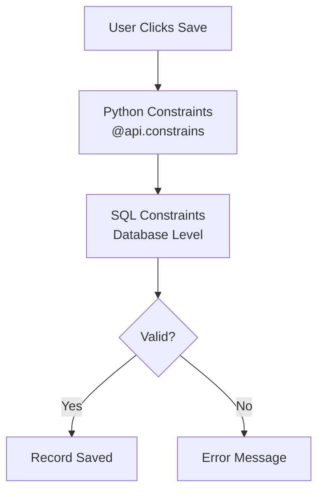
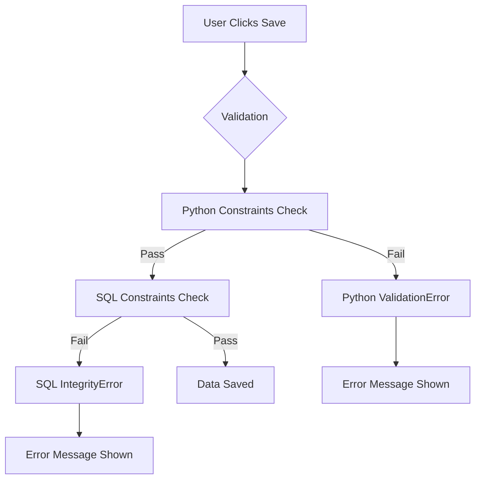

# Constraints - Data Validation Rules

::: info What Are Constraints?
Constraints are validation rules that prevent bad data from being saved. When you see an error like *"Barcode must be unique"* during a product import, that's a constraint blocking duplicate barcodes before they cause inventory problems.

Constraints are the last line of defense for data integrity - they cannot be bypassed by anyone, including administrators.
:::

## Why Constraints Exist

Without constraints, users could:
- Enter negative values where only positive makes sense (like negative stock quantities)
- Create duplicate records that should be unique (like two products with the same barcode)
- Create circular relationships (Department A reports to B, B reports to A)
- Enter invalid percentages (like 150% discount)
- Leave required combinations incomplete

Constraints catch these issues **at save time** and display a clear error message explaining what's wrong.

## Two Types of Constraints

### Visual Comparison



### SQL Constraints

| Aspect | Details |
| :--- | :--- |
| **What** | Rules enforced by the database itself |
| **When checked** | When data is written to database |
| **Speed** | Very fast (database-level) |
| **Flexibility** | Limited to single-table checks |
| **Bypass possible?** | No - enforced at database level |

**Best for:**
- Uniqueness (no duplicates)
- Simple value checks (positive numbers)
- Required combinations
- Range validations

**Example errors:**
- *"Code must be unique."*
- *"Quotation validity days cannot be negative."*

### Python Constraints

| Aspect | Details |
| :--- | :--- |
| **What** | Custom validation logic in code |
| **When checked** | Before data reaches database |
| **Speed** | Slower (runs Python code) |
| **Flexibility** | Can check anything (related records, complex logic) |
| **Bypass possible?** | No - part of ORM |

**Best for:**
- Business logic validation
- Cross-field checks
- Relationship validation
- Conditional validation
- Multi-company checks

**Example errors:**
- *"You cannot create recursive departments."*
- *"Prepayment percentage must be a valid percentage."*

## SQL vs Python Constraints: Decision Matrix

| Scenario | Use SQL | Use Python | Why |
| :--- | :---: | :---: | :--- |
| **Field must be globally unique** | ✅ | ❌ | Simple unique constraint |
| **Unique with conditions** | ❌ | ✅ | Conditional logic needs Python |
| **Value must be positive** | ✅ | ❌ | Simple CHECK constraint |
| **Value must be in range** | ✅ | ❌ | CHECK (value BETWEEN 0 AND 100) |
| **Combination must be unique** | ✅ | ❌ | unique(field1, field2) |
| **No circular references** | ❌ | ✅ | Requires traversing relationships |
| **Check related records** | ❌ | ✅ | SQL can't check other tables |
| **Conditional validation** | ❌ | ✅ | "Only check if field X is set" |
| **Date comparison logic** | ❌ | ✅ | Complex date math |
| **Multi-company checks** | ❌ | ✅ | Requires context and ORM |
| **Custom error messages** | ~ | ✅ | Python offers more flexibility |

::: tip The Golden Rule for Developers
**Use SQL constraints when possible, Python constraints when necessary.**

SQL constraints are simpler, faster, and more reliable. Only reach for Python when you need complex business logic, context awareness, or dynamic messages.
:::

## Real Examples from Odoo 19

### SQL Constraints

#### Unique Code (Link Tracker)
```python
_sql_constraints = [
    ('code_unique', 'unique(code)', 'Code must be unique.')
]
```

#### Positive Value Only (Company Settings)
```python
_sql_constraints = [
    ('quotation_validity_days_positive',
     'CHECK(quotation_validity_days >= 0)',
     'Quotation validity days cannot be negative.')
]
```

#### Time Range Validation (Lunch Supplier)
```python
_sql_constraints = [
    ('automatic_email_time_range',
     'CHECK(automatic_email_time >= 0 AND automatic_email_time <= 12)',
     'Automatic email time must be between 0 and 12 hours.')
]
```

#### Multi-Field Uniqueness (Slide/Partner)
```python
_sql_constraints = [
    ('slide_partner_unique',
     'unique(slide_id, partner_id)',
     'A user cannot be enrolled in the same slide twice.')
]
```

### Python Constraints

#### Example 1: Preventing Circular References

**Model:** HR Department

```python
@api.constrains('parent_id')
def _check_parent_id(self):
    if self._has_cycle():
        raise ValidationError(
            _('You cannot create recursive departments.')
        )
```

**What it does:** Prevents creating a loop where Department A → B → C → A.

#### Example 2: Percentage Validation

**Model:** Company Settings

```python
@api.constrains('prepayment_percent')
def _check_prepayment_percent(self):
    for company in self:
        if company.portal_confirmation_pay:
            if not (0 < company.prepayment_percent <= 1.0):
                raise ValidationError(
                    _('Prepayment percentage must be between 0 and 100%.')
                )
```

**What it does:** Ensures percentage is valid only when payment confirmation is enabled.

#### Example 3: Cross-Company Product Validation

**Model:** Sale Order

```python
@api.constrains('company_id', 'order_line')
def _check_order_line_company_id(self):
    for order in self:
        for line in order.order_line:
            if line.product_id.company_id:
                if line.product_id.company_id != order.company_id:
                    raise ValidationError(
                        _("Product %s belongs to company %s, "
                          "not %s.") % (
                            line.product_id.name,
                            line.product_id.company_id.name,
                            order.company_id.name
                        )
                    )
```

**What it does:** Prevents adding Company B's products to Company A's quotation.

#### Example 4: Date Range Validation

**Model:** Event

```python
@api.constrains('date_begin', 'date_end')
def _check_dates(self):
    for event in self:
        if event.date_end < event.date_begin:
            raise ValidationError(
                _('End date cannot be before start date.')
            )
```

## Common Constraints You'll Encounter

| Module | What's Checked | Error You'll See |
| :--- | :--- | :--- |
| **Products** | Barcode uniqueness | "Barcode must be unique." |
| **HR** | No recursive departments | "You cannot create recursive departments." |
| **Sale** | Valid prepayment percentage | "Prepayment percentage must be valid." |
| **Accounting** | Journal entry balance | "The balance is not zero." |
| **Partners** | Valid email format | "Invalid email address." |
| **Inventory** | Positive quantities | "Quantity must be positive." |
| **Timesheet** | Hours in valid range | "Hours cannot exceed 24." |
| **Leave** | No overlapping leaves | "Leave dates overlap with existing leave." |

## Constraint Error Flow



## For Consultants: What This Means

### Key Takeaways

1. **Constraints protect data quality** - They prevent mistakes before they happen
2. **Error messages are clues** - Read them carefully; they explain exactly what's wrong
3. **Can't be bypassed** - Unlike access rights, constraints apply to everyone including admins
4. **Studio can't add them** - Constraints require code; custom validation needs a developer
5. **Imports must comply** - Bulk imports fail if data violates constraints

### When Users Report Constraint Errors

1. **Read the error message** - It usually explains the problem clearly
2. **Check for duplicates** - Uniqueness constraints are the most common cause
3. **Look at related records** - Python constraints often check relationships
4. **Verify the data makes sense** - Is the percentage valid? Is the quantity positive?
5. **Check dates** - End date before start date is common

### Import Troubleshooting

| Error During Import | Likely Cause | Solution |
| :--- | :--- | :--- |
| "Duplicate key violation" | Unique constraint | Remove duplicates from file |
| "Check constraint violation" | Value out of range | Fix invalid values |
| "ValidationError" | Python constraint | Fix business logic issue |
| "Not null violation" | Required field empty | Fill in required fields |

## Constraints vs Required Fields

::: tip Don't Confuse These
| Concept | What It Checks | Enforcement |
| :--- | :--- | :--- |
| **Required Field** | Must have a value (any value) | `required=True` on field |
| **Constraint** | Must have a *valid* value | SQL or Python constraint |

A field can be both required AND constrained.

**Example:** `quantity` field
- Required: Must have a value
- Constraint: Value must be positive

The required check happens first; if empty, user sees "Required" error. If filled with -5, user sees constraint error "Quantity must be positive."
:::

## Constraints vs Onchange

| Aspect | Constraints | Onchange |
| :--- | :--- | :--- |
| **When runs** | On save | On field change (live) |
| **Blocks save?** | Yes | No (just warns/modifies) |
| **Bypassable?** | No | Yes (via API/import) |
| **Purpose** | Enforce rules | Guide user input |
| **Best for** | Hard requirements | Soft guidance, auto-fill |

::: info Use Both Together
- **Onchange:** Warn user immediately when entering invalid percentage
- **Constraint:** Block save if somehow invalid value still exists

Belt and suspenders approach.
:::

## Requesting New Constraints

When you need custom validation that doesn't exist:

**For developers, provide:**
1. **Model:** Which model needs the constraint
2. **Fields involved:** Which fields to check
3. **Rule:** What must be true/false
4. **Error message:** What to tell the user
5. **Conditions:** When should this apply

**Example request:**
> "On `purchase.order`, ensure that `date_planned` is not before today when the order is confirmed. Error message: 'Planned date cannot be in the past for confirmed orders.'"

## Knowledge Check

::: details Q1: What's the difference between SQL and Python constraints?
**Answer: SQL is faster and database-level; Python can check complex logic**

SQL constraints are simple rules (uniqueness, ranges) enforced by the database. Python constraints can check related records, multi-company rules, and conditional logic.
:::

::: details Q2: Can administrators bypass constraints?
**Answer: No - constraints apply to everyone**

Unlike access rights, constraints are enforced at the ORM and database level. Even administrators cannot save invalid data.
:::

::: details Q3: Import fails with "unique constraint violation." What happened?
**Answer: The import file contains duplicate values for a unique field**

The database won't allow two records with the same value in a unique field (like barcode or code). Find and remove duplicates from the import file.
:::

::: details Q4: What's the difference between required=True and a constraint?
**Answer: Required checks for any value; constraint checks for valid value**

Required ensures the field isn't empty. Constraint ensures the value meets specific rules (positive, in range, unique, etc.). A field can have both.
:::

::: details Q5: User sees "You cannot create recursive departments." What should they check?
**Answer: The parent department creates a loop**

The department's parent, grandparent, etc. eventually points back to itself. Remove the circular reference by choosing a different parent department.
:::

