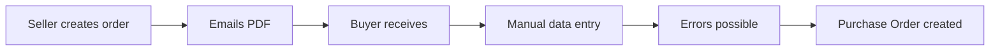
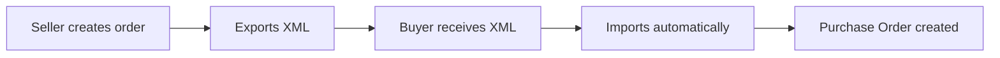
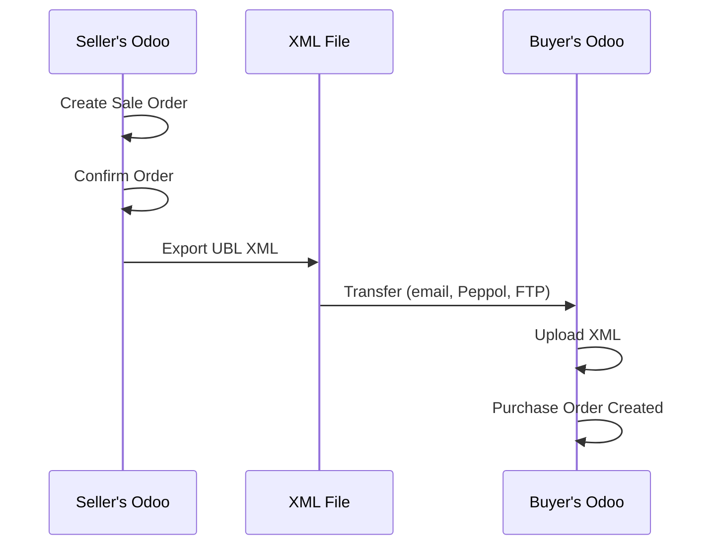
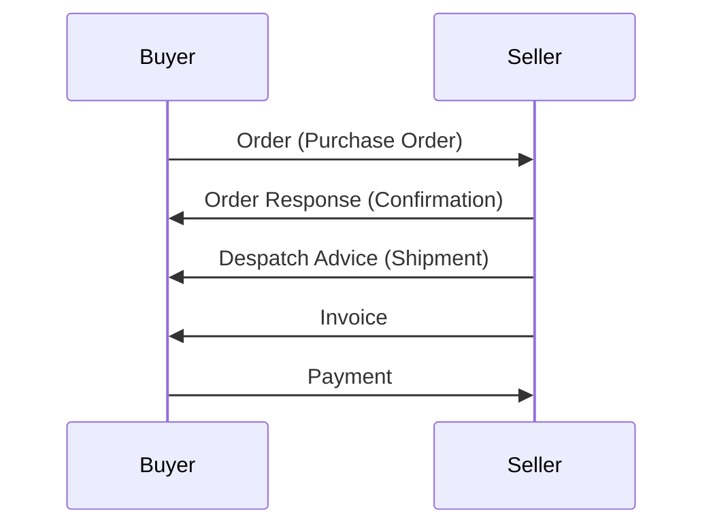

# EDI Order Exchange (UBL) <Badge type="tip" text="New in 19" />

<p>Odoo 19 introduces <strong>electronic order interchange</strong> using the UBL BIS 3 (Peppol) standard. This allows businesses to exchange purchase orders and sales orders as XML files - no manual data entry required.</p>

::: info What is UBL?
**Universal Business Language (UBL)** is an international XML standard for business documents. The **Peppol BIS Ordering 3.5** format is widely used in Europe for B2B e-commerce, enabling:
- Automated order exchange between companies
- Standardized format understood by any compliant software
- Reduced errors from manual data entry
- Faster order processing
- Legal compliance for e-invoicing requirements
:::

## Why EDI Matters

### The Problem Without EDI



**Issues:**
- Manual data entry takes time
- Typos and errors
- Inconsistent formatting
- No automation possible
- Hard to track status

### The Solution With EDI



**Benefits:**
- Zero manual entry
- No typos
- Standardized format
- Full automation
- Complete audit trail

## How It Works

### The Order Exchange Flow



### Step-by-Step

| Step | Seller (Your Customer) | Buyer (Your Company) |
| :--- | :--- | :--- |
| 1 | Creates Sale Order in their Odoo | - |
| 2 | Confirms order | - |
| 3 | Downloads XML from portal: "Connect with your software!" | - |
| 4 | Sends XML file (email, Peppol network, FTP) | Receives XML file |
| 5 | - | Uploads XML in Purchase Orders |
| 6 | - | Purchase Order created automatically |

## For Sellers: Exporting Orders

### Customer Portal Download

When your customer has a portal account:

1. Customer receives Sale Order confirmation email
2. Clicks "View Order" to open portal
3. Clicks **"Connect with your software!"** button
4. Downloads XML file (filename: `SO001_order.xml`)

**Direct URL:** `/my/orders/<order_id>/download_edi`

### What's in the XML?

The exported XML includes all order details:

| Section | Contents |
| :--- | :--- |
| **Header** | Order reference, date, currency, validity period |
| **Buyer Party** | Company name, VAT, address, contact |
| **Seller Party** | Supplier info with identifiers |
| **Delivery** | Shipping address, requested date |
| **Payment Terms** | From the order's payment term |
| **Order Lines** | Products, quantities, prices, taxes |
| **Totals** | Subtotal, tax amounts, grand total |

### XML Structure Example

```xml
<?xml version="1.0" encoding="UTF-8"?>
<Order xmlns="urn:oasis:names:specification:ubl:schema:xsd:Order-2">
  <ID>SO/2024/00042</ID>
  <IssueDate>2024-12-15</IssueDate>
  <DocumentCurrencyCode>EUR</DocumentCurrencyCode>

  <BuyerCustomerParty>
    <Party>
      <PartyName><Name>Acme Corporation</Name></PartyName>
      <PartyTaxScheme>
        <CompanyID>BE0123456789</CompanyID>
      </PartyTaxScheme>
    </Party>
  </BuyerCustomerParty>

  <OrderLine>
    <LineItem>
      <ID>1</ID>
      <Quantity unitCode="EA">10</Quantity>
      <LineExtensionAmount currencyID="EUR">500.00</LineExtensionAmount>
      <Item>
        <Name>Widget Pro</Name>
        <SellersItemIdentification><ID>WIDGET-PRO</ID></SellersItemIdentification>
      </Item>
      <Price><PriceAmount currencyID="EUR">50.00</PriceAmount></Price>
    </LineItem>
  </OrderLine>
</Order>
```

## For Buyers: Importing Orders

### Creating Purchase Orders from XML

When you receive an order XML from a supplier:

1. Go to **Purchase → Orders → Requests for Quotation**
2. Click **"Upload"** button in the list view (or drag-drop)
3. Select the XML file
4. Odoo parses the XML and creates a new Purchase Order

### Auto-Matching Logic

| XML Field | Matched To | Matching Logic |
| :--- | :--- | :--- |
| SellerSupplierParty | Partner (Vendor) | VAT number first, then name, or creates new |
| SellersItemIdentification | Product | Vendor's product code from pricelist |
| BuyersItemIdentification | Product | Your internal reference |
| TaxCategory | Taxes | Tax percentage + type |
| DeliveryParty | Delivery Address | Address matching or creates contact |
| PaymentTerms | Payment Terms | Matches by name or creates |

### Setting Up Vendor Product Codes

For accurate product matching, configure vendor pricelists:

1. Go to **Purchase → Products → Products**
2. Select a product
3. Go to **Purchase** tab
4. Add vendor with their product code

| Field | Purpose | Example |
| :--- | :--- | :--- |
| **Vendor** | Supplier partner | "Acme Supplies" |
| **Vendor Product Code** | Their SKU | "ACME-WGT-001" |
| **Your Product** | Your internal product | "Widget Pro" |
| **Price** | Their price to you | 45.00 |

## Document Types in EDI

### Supported Documents

| Document | Direction | Purpose |
| :--- | :--- | :--- |
| **Order** | Buyer → Seller | Place an order |
| **Order Response** | Seller → Buyer | Confirm/reject order |
| **Despatch Advice** | Seller → Buyer | Shipment notification |
| **Invoice** | Seller → Buyer | Request payment |
| **Credit Note** | Seller → Buyer | Refund/correction |

### Document Flow



## Business Scenarios

### Scenario 1: Multi-Company Order Flow

**Setup:** Company A sells to Company B, both use Odoo

1. **Company A (Seller):** Creates Sale Order SO/2024/001 for Company B
2. **Company A:** Confirms order → Customer receives portal link
3. **Company B (Buyer):** Downloads XML from Company A's portal
4. **Company B:** Uploads XML → Purchase Order PO/2024/042 created automatically

**Result:** Both orders linked, no manual data entry, no errors

### Scenario 2: Cross-Platform Exchange

**Setup:** Your company uses Odoo, supplier uses SAP

1. Supplier creates order in SAP
2. SAP exports Peppol BIS 3 XML
3. Supplier emails XML to you
4. You upload XML in Odoo
5. Purchase Order created with all details

**Result:** Works because both systems speak UBL

### Scenario 3: Peppol Network

**Setup:** Both parties are on Peppol network

1. Seller creates and confirms order
2. Order automatically sent via Peppol Access Point
3. Buyer's system receives and imports automatically
4. No manual file transfer needed

**Result:** Fully automated, no email/file handling

## Peppol Network

### What is Peppol?

**Peppol (Pan-European Public Procurement Online)** is a network for exchanging electronic business documents:

| Aspect | Details |
| :--- | :--- |
| **Coverage** | 39+ countries worldwide |
| **Documents** | Orders, invoices, credit notes |
| **Format** | UBL BIS 3 standard |
| **Transport** | Secure AS4 messaging |
| **Identifiers** | Peppol ID for each participant |

### Connecting to Peppol

1. **Get a Peppol ID** - Register with an Access Point provider
2. **Configure Odoo** - Enter your Peppol credentials
3. **Exchange documents** - Automatic sending/receiving

::: warning Peppol Providers
Odoo doesn't provide direct Peppol connectivity. You need an Access Point provider:
- Storecove
- Basware
- Pagero
- Many country-specific providers
:::

## Technical Details

### Modules & Auto-Install

| Module | Purpose | Auto-Install When |
| :--- | :--- | :--- |
| `sale_edi_ubl` | Export Sale Orders as UBL XML | sale + account_edi_ubl_cii installed |
| `purchase_edi_ubl_bis3` | Import/Export Purchase Orders | purchase + account_edi_ubl_cii installed |
| `account_edi_ubl_cii` | Core UBL/CII parsing library | Manual or via localization |

### Checking Installation

1. Go to **Apps**
2. Search for "UBL" or "EDI"
3. Install required modules

### Configuration

1. **Company VAT:** Settings → Companies → VAT number (required for party identification)
2. **Peppol ID:** Partner form → Accounting tab → Peppol Endpoint
3. **Product Codes:** Products → Purchase tab → Vendor pricelists

## Handling Import Issues

### When Matching Fails

If some data couldn't be imported:
- An **activity is scheduled** to review
- Partially matched data is saved
- Manual intervention required for unmatched items

### Common Issues

| Issue | Cause | Solution |
| :--- | :--- | :--- |
| Vendor not found | No matching VAT/name | Create vendor or fix VAT |
| Product not found | No matching code | Add vendor product code |
| Tax not found | Different tax rate | Create matching tax |
| Address mismatch | Different format | Create/link address |

### Best Practices for Matching

1. **Configure vendor VAT numbers** - Primary matching key
2. **Set up vendor product codes** - In purchase pricelists
3. **Standardize tax codes** - Match with trading partners
4. **Test with sample files** - Before going live

## Integration Patterns

### Email-Based Exchange

```
Seller → Email with XML attachment → Buyer uploads manually
```
- Simple setup
- Manual step required
- Good for occasional orders

### Peppol Network

```
Seller → Access Point → Peppol Network → Access Point → Buyer
```
- Fully automated
- Requires Peppol registration
- Best for high-volume B2B

### Direct API

```
Seller's system → API call → Buyer's system
```
- Custom integration
- Real-time exchange
- Requires development

## Compliance & Legal

### E-Invoicing Mandates

Many countries now require electronic invoicing:

| Country | Requirement |
| :--- | :--- |
| **Italy** | Mandatory since 2019 |
| **France** | Phased 2024-2026 |
| **Germany** | Required for B2G |
| **Belgium** | B2G mandatory |
| **Poland** | KSeF from 2026 |

### Benefits for Compliance

- Standardized format accepted by authorities
- Automatic archiving
- Audit trail
- Tax reporting integration

## Knowledge Check

::: details Q1: What is the main benefit of UBL order exchange?
**Answer: Eliminates manual data entry and reduces errors**

UBL XML files contain all order information in a standardized format. The receiving system can automatically create records without human intervention, eliminating typos and data entry time.
:::

::: details Q2: How do you download an order XML for a customer?
**Answer: Customer clicks "Connect with your software!" on the portal**

After confirming a sale order, customers can access their portal, view the order, and click the download button to get the UBL XML file.
:::

::: details Q3: Product matching fails during import. What should you configure?
**Answer: Vendor product codes in purchase pricelists**

Go to the product, Purchase tab, and add the vendor with their product code (SellersItemIdentification). This allows Odoo to match the XML product code to your internal product.
:::

::: details Q4: What's the difference between direct file exchange and Peppol?
**Answer: Peppol is automated via a network; files require manual transfer**

With direct files, you manually send/receive XML via email. Peppol is a network where documents route automatically between registered participants through Access Points.
:::

::: details Q5: Can Odoo exchange EDI documents with non-Odoo systems?
**Answer: Yes - any UBL/Peppol compliant system**

UBL is an international standard. Any system that can export/import UBL BIS 3 XML (SAP, Microsoft, Oracle, etc.) can exchange documents with Odoo.
:::

