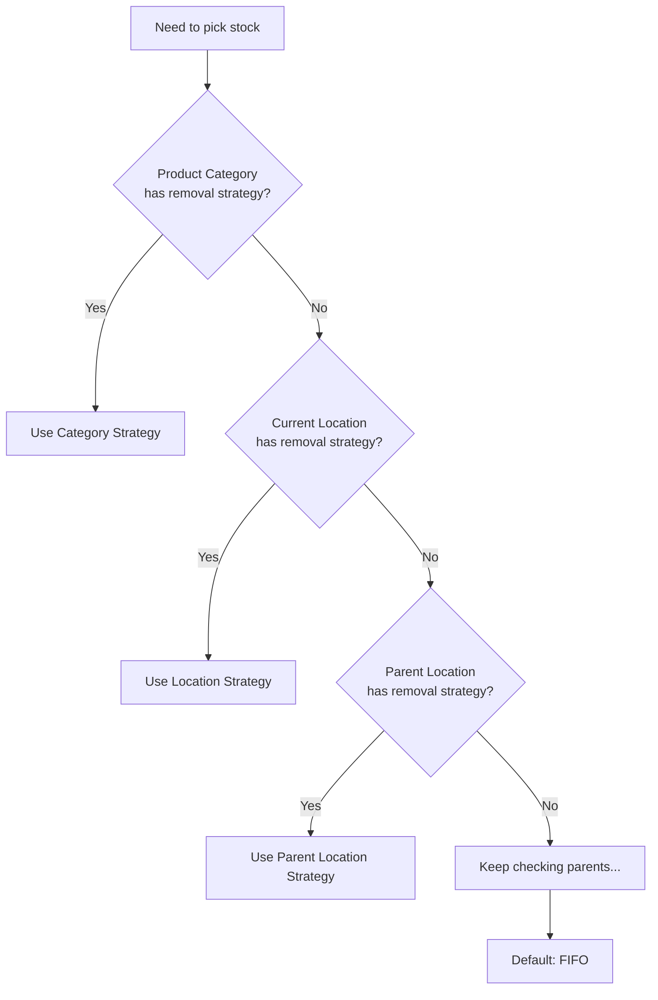
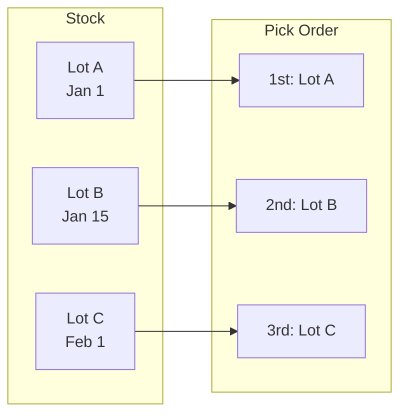
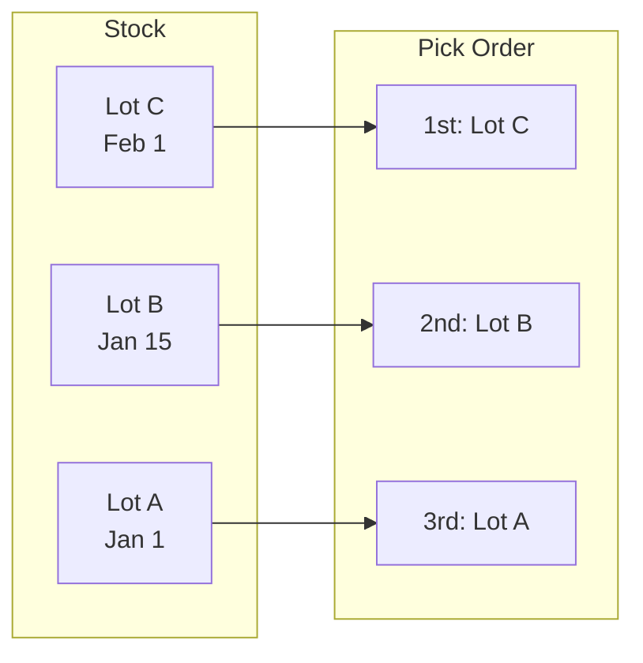
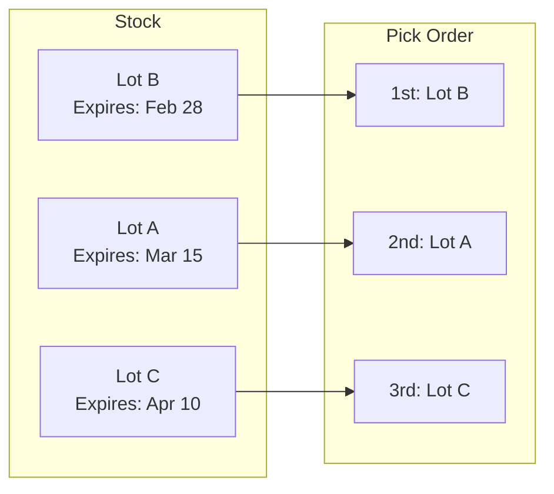
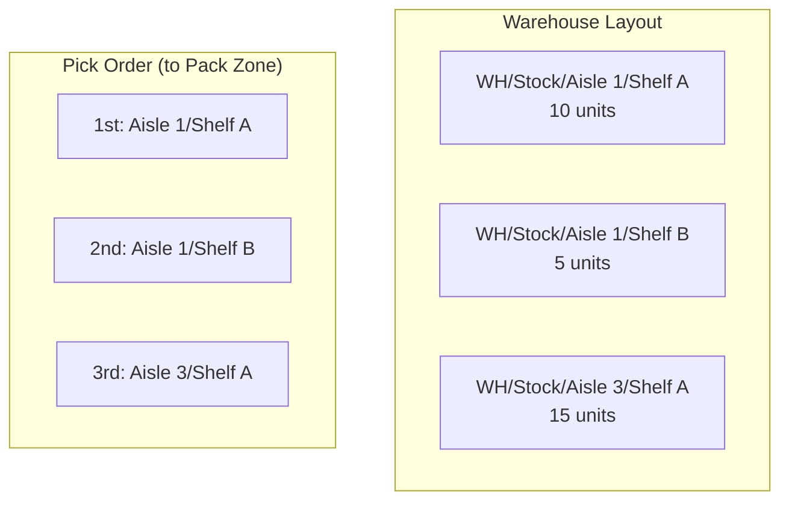
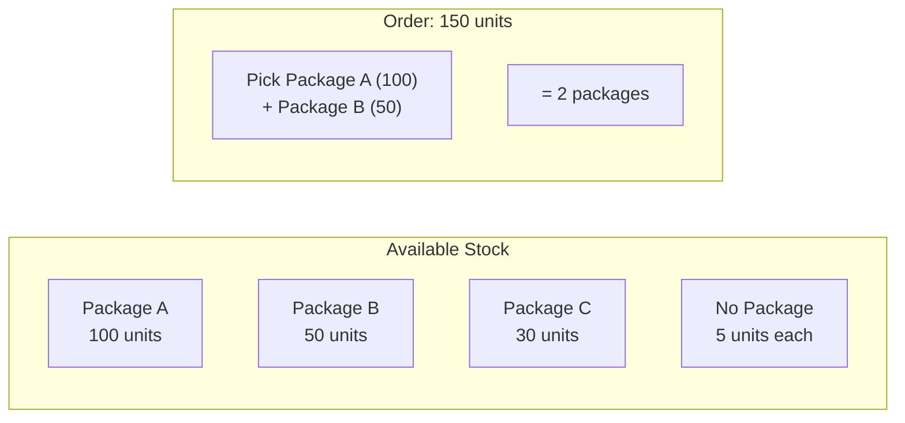

# Removal Strategies in Odoo

## What Are Removal Strategies?

Removal strategies determine **which specific stock items are picked first** when processing outgoing transfers, manufacturing orders, or any operation that removes products from inventory.

::: tip Why Removal Strategies Matter
When you have multiple lots, serial numbers, or packages of the same product in stock, Odoo needs to know which ones to pick first. The removal strategy controls this order based on:
- **When items arrived** (FIFO/LIFO)
- **When items expire** (FEFO)
- **Where items are located** (Closest Location)
- **How items are packaged** (Least Packages)

Understanding removal strategies helps you:
- **Optimize warehouse operations** for efficiency
- **Ensure regulatory compliance** for food, pharmaceuticals, cosmetics
- **Reduce waste** from expired products
- **Improve picking efficiency** by minimizing travel distance
:::

## Available Removal Strategies

Odoo 19 includes **5 removal strategies** out of the box:

| Strategy | Technical Name | Module | Description |
| :--- | :--- | :--- | :--- |
| **FIFO** | `fifo` | Stock (base) | First In, First Out - oldest items picked first |
| **LIFO** | `lifo` | Stock (base) | Last In, First Out - newest items picked first |
| **Closest Location** | `closest` | Stock (base) | Items closest to destination picked first |
| **Least Packages** | `least_packages` | Stock (base) | Minimizes number of packages used |
| **FEFO** | `fefo` | Product Expiry | First Expired, First Out - soonest expiring items first |

::: info Default Strategy
When no removal strategy is configured, Odoo defaults to **FIFO** (First In, First Out).
:::

## Where to Configure Removal Strategies

Removal strategies can be set at **two levels**, with a specific priority order:

### 1. Product Category Level (Highest Priority)

**Configuration → Inventory → Product Categories → Force Removal Strategy**

```
Product Category: Food Items
├── Force Removal Strategy: FEFO
└── This applies to ALL products in this category
```

When set at the product category, this strategy **overrides** any location-based setting.

### 2. Location Level (Fallback)

**Inventory → Configuration → Locations → Removal Strategy**

```
Location: WH/Stock/Shelf A
├── Removal Strategy: LIFO
└── Applies when product category has no strategy
```

If a location has no removal strategy set, Odoo checks its **parent locations** up the hierarchy until it finds one.

### Priority Lookup Order



## Detailed Strategy Explanations

### FIFO - First In, First Out

**Order: `in_date ASC, id`** (oldest arrival date first)



**Use Cases:**
- Standard warehouse operations
- Electronics and non-perishable goods
- Accounting alignment (cost of goods sold based on oldest purchases)
- Default for most businesses

**Business Example:**
A hardware store receives screws in batches. FIFO ensures older inventory is sold first, reducing the risk of obsolescence if product specifications change.

---

### LIFO - Last In, First Out

**Order: `in_date DESC, id DESC`** (newest arrival date first)



**Use Cases:**
- Non-perishable bulk materials (sand, gravel, coal)
- Items stored in stacks where newest is on top
- Construction materials
- Situations where accessing older stock is impractical

**Business Example:**
A construction company stores sand in a pile. New deliveries are added on top, and workers take from the top of the pile (LIFO is natural for this storage method).

::: warning Tax Implications
LIFO inventory valuation has different tax implications in some jurisdictions. While Odoo's removal strategy affects physical picking, consult with your accountant about inventory valuation methods.
:::

---

### FEFO - First Expired, First Out

**Order: `removal_date, in_date, id`** (earliest removal date first)

::: info Requires Product Expiry Module
FEFO is only available when the **Product Expiry** module (`product_expiry`) is installed. Enable it at:
**Settings → Inventory → Traceability → Expiration Dates**
:::



**Expiration Date Fields:**

The Product Expiry module adds **four date fields** to lots/serial numbers. These dates are automatically calculated based on the product's configuration when a lot is created (typically at goods receipt).

| Field | Technical Name | Purpose | When It's Used |
| :--- | :--- | :--- | :--- |
| **Expiration Date** | `expiration_date` | Product becomes dangerous/unusable | Legal compliance, cannot be sold after |
| **Best Before Date** | `use_date` | Quality starts to deteriorate | Customer-facing date on packaging |
| **Removal Date** | `removal_date` | Should be removed from sellable stock | **Used by FEFO** for picking order |
| **Alert Date** | `alert_date` | Triggers warnings for action | Internal alerts, markdown decisions |

::: info How Dates Are Calculated
When a lot/serial number is created, Odoo calculates the Expiration Date based on the **current date + expiration_time**. The other dates are calculated **backwards from the Expiration Date**:

```python
# From production_lot.py - when lot is created:
expiration_date = datetime.now() + timedelta(days=expiration_time)

# Other dates calculated backwards:
use_date = expiration_date - timedelta(days=use_time)
removal_date = expiration_date - timedelta(days=removal_time)
alert_date = expiration_date - timedelta(days=alert_time)
```

**Example:**
```
Lot Created: January 1st
Expiration Time on Product: 30 days
→ Expiration Date = January 31st

Use Time: 5 days → Best Before = January 26th (31 - 5)
Removal Time: 7 days → Removal Date = January 24th (31 - 7)
Alert Time: 10 days → Alert Date = January 21st (31 - 10)
```
:::

**Product Template Configuration:**

The time values are set on the **Product Template** form under the Inventory tab:

| Field | Technical Name | Meaning | Example Value |
| :--- | :--- | :--- | :--- |
| **Expiration Time** | `expiration_time` | Days from receipt until product expires | 30 days |
| **Best Before Time** | `use_time` | Days before expiration when quality declines | 5 days |
| **Removal Time** | `removal_time` | Days before expiration to remove from stock | 7 days |
| **Alert Time** | `alert_time` | Days before expiration to raise alerts | 10 days |

**Real-World Example: Fresh Milk**

```
Product: Fresh Milk
├── Use Expiration Date: ✓ (enabled)
├── Expiration Time: 14 days
├── Best Before Time: 3 days (shows "Best Before" 3 days before expiry)
├── Removal Time: 2 days (stop selling 2 days before expiry)
└── Alert Time: 5 days (alert warehouse 5 days before expiry)

Scenario: Milk received on January 1st
├── Expiration Date: January 15th (14 days later)
├── Best Before Date: January 12th (15 - 3)
├── Removal Date: January 13th (15 - 2) ← FEFO uses this!
└── Alert Date: January 10th (15 - 5)
```

::: warning Critical: FEFO Uses Removal Date, Not Expiration Date
The FEFO strategy sorts by **Removal Date**, not Expiration Date. This is intentional:
- Products should leave stock **before** they expire
- Gives buffer time for shipping to customer
- Customer receives product with remaining shelf life

If Removal Date is not set, FEFO falls back to Expiration Date.
:::

**What Happens When Removal Date Passes?**

When a lot's removal date passes, Odoo automatically sets `available_quantity = 0`:

```python
# From stock_quant.py in product_expiry module:
@api.depends('removal_date')
def _compute_available_quantity(self):
    super()._compute_available_quantity()
    current_date = fields.Datetime.now()
    for quant in self:
        if quant.use_expiration_date and quant.removal_date and quant.removal_date <= current_date:
            quant.available_quantity = 0
```

**What this means:**
1. **Available Quantity becomes 0** - the lot is no longer considered "fresh"
2. **Stock On Hand remains unchanged** - product is still physically there
3. **Picking will skip this lot** - FEFO moves to next available lot
4. **Alerts may trigger** - if alert_date was reached and cron job is active

This prevents accidentally shipping products that are too close to expiration.

**Timeline Visualization:**

```
Receipt                Alert    Removal  Best Before  Expiration
   │                     │         │         │            │
   ▼                     ▼         ▼         ▼            ▼
───┬─────────────────────┬─────────┬─────────┬────────────┬───►
   │                     │         │         │            │
Day 1                  Day 10   Day 13    Day 12       Day 15
                         │         │         │            │
                    Raise alert  Stop    Quality      Product
                    for review  selling  declines     expires
```

**Use Cases:**
- Food and beverages
- Pharmaceuticals
- Cosmetics and personal care
- Any perishable goods

**Business Example:**
A pharmacy stocks medications with different expiration dates. FEFO ensures medications closest to their removal date are dispensed first, minimizing waste from expired products.

---

### Closest Location

**Order: Location complete name (alphabetically), then by ID**

This strategy sorts quants by the **full path of the location** (`complete_name` field), which naturally groups nearby locations together.



**Use Cases:**
- Large warehouses with many locations
- Reducing picker travel distance
- Optimizing pick paths
- Wave picking operations

**Business Example:**
A distribution center uses the closest location strategy to minimize picker walking distance. When fulfilling orders, items from nearby shelves are picked first, improving efficiency.

::: tip Location Naming Convention
For Closest Location to work optimally, use **consistent hierarchical naming**:
- `WH/Zone A/Aisle 1/Rack 01/Shelf 01`
- `WH/Zone A/Aisle 1/Rack 01/Shelf 02`
- `WH/Zone A/Aisle 2/Rack 01/Shelf 01`

This ensures alphabetical sorting reflects physical proximity.
:::

---

### Least Packages

**Order: FIFO within selected packages** (minimizes package count)

This strategy uses an **A* algorithm** to find the optimal combination of packages that:
1. Fulfills the required quantity
2. Uses the minimum number of packages



**How It Works:**
1. Odoo calculates available quantity per package
2. A* algorithm finds the minimum packages needed
3. Falls back to FIFO ordering within selected packages
4. Individual items (no package) count as 1 package each

**Use Cases:**
- Full pallet shipping
- Minimizing handling/repackaging
- Container shipping
- Wholesale distribution

**Business Example:**
A beverage distributor needs to ship 500 bottles. Instead of picking from 10 partial packages, Least Packages selects 2 full pallets (250 bottles each), reducing handling and maintaining package integrity.

::: warning Memory Considerations
The A* algorithm may consume significant memory for very large inventories with many package combinations. Odoo logs a warning if memory limits are reached and falls back to standard FIFO.
:::

## Technical Implementation

### The `product.removal` Model

Removal strategies are stored as records in the `product.removal` model:

```python
class ProductRemoval(models.Model):
    _name = 'product.removal'
    _description = 'Removal Strategy'

    name = fields.Char('Name', required=True, translate=True)
    method = fields.Char("Method", required=True, translate=True,
                         help="FIFO, LIFO...")
```

### Data Records

**Community (stock module):**
```xml
<record id="removal_fifo" model="product.removal">
    <field name="name">First In First Out (FIFO)</field>
    <field name="method">fifo</field>
</record>
<record id="removal_lifo" model="product.removal">
    <field name="name">Last In First Out (LIFO)</field>
    <field name="method">lifo</field>
</record>
<record id="removal_closest" model="product.removal">
    <field name="name">Closest Location</field>
    <field name="method">closest</field>
</record>
<record id="removal_least_packages" model="product.removal">
    <field name="name">Least Packages</field>
    <field name="method">least_packages</field>
</record>
```

**Product Expiry Module:**
```xml
<record id="removal_fefo" model="product.removal">
    <field name="name">First Expiry First Out (FEFO)</field>
    <field name="method">fefo</field>
</record>
```

### Key Methods in `stock.quant`

**Getting the removal strategy:**
```python
@api.model
def _get_removal_strategy(self, product_id, location_id):
    # Priority 1: Product category
    if product_id.categ_id.removal_strategy_id:
        return product_id.categ_id.removal_strategy_id.method

    # Priority 2: Location hierarchy
    loc = location_id
    while loc:
        if loc.removal_strategy_id:
            return loc.removal_strategy_id.method
        loc = loc.location_id  # Check parent

    # Default: FIFO
    return 'fifo'
```

**Determining sort order:**
```python
@api.model
def _get_removal_strategy_order(self, removal_strategy):
    if removal_strategy in ['fifo', 'least_packages']:
        return 'in_date ASC, id'
    elif removal_strategy == 'lifo':
        return 'in_date DESC, id DESC'
    elif removal_strategy == 'closest':
        return False  # Special sorting by location name
    elif removal_strategy == 'fefo':  # Added by product_expiry
        return 'removal_date, in_date, id'
```

## Practical Configuration Examples

### Example 1: Food Distribution Company

```
Product Categories:
├── Fresh Produce
│   └── Force Removal Strategy: FEFO
├── Frozen Foods
│   └── Force Removal Strategy: FEFO
├── Dry Goods
│   └── Force Removal Strategy: FIFO
└── Cleaning Supplies
    └── Force Removal Strategy: (none - uses location default)

Locations:
└── Main Warehouse
    ├── Removal Strategy: FIFO (default)
    ├── Cold Storage
    │   └── (inherits FIFO, but products use FEFO via category)
    └── Bulk Storage
        └── Removal Strategy: LIFO (stacked storage)
```

### Example 2: Large Distribution Center

```
Product Categories:
└── All Products
    └── Force Removal Strategy: (none)

Locations:
└── Distribution Center
    ├── Removal Strategy: Closest Location
    ├── Picking Zone A (Fast Movers)
    │   └── (inherits Closest Location)
    ├── Picking Zone B (Medium Movers)
    │   └── (inherits Closest Location)
    └── Bulk Storage
        └── Removal Strategy: Least Packages
```

### Example 3: Pharmaceutical Warehouse

```
Product Categories:
├── Prescription Medications
│   └── Force Removal Strategy: FEFO
├── OTC Medications
│   └── Force Removal Strategy: FEFO
└── Medical Supplies
    └── Force Removal Strategy: FIFO

Settings:
└── Product Expiry module: Enabled
    ├── All medications have expiration tracking
    └── Removal dates set 30 days before expiration
```

## Best Practices

### Choosing the Right Strategy

| Situation | Recommended Strategy |
| :--- | :--- |
| Perishable goods | FEFO |
| Standard warehouse | FIFO |
| Bulk materials (stacked) | LIFO |
| Large warehouse (reduce walking) | Closest Location |
| Full pallet shipping | Least Packages |
| Regulatory compliance (pharma/food) | FEFO |

### Tips for Implementation

::: tip Set Strategy at Category Level
For products that always need the same strategy (like perishables), set it at the **product category** level. This ensures consistency and reduces configuration errors.
:::

::: tip Use Location Strategy as Default
Set a sensible default (usually FIFO) at your main stock location. Child locations inherit this unless they have their own strategy.
:::

::: warning Test Before Go-Live
Before implementing a new removal strategy in production:
1. Test with sample data
2. Verify picking order matches expectations
3. Train warehouse staff on any changes
:::

### Common Mistakes to Avoid

| Mistake | Impact | Solution |
| :--- | :--- | :--- |
| No strategy configured | Random picking order | Set FIFO as default on stock location |
| FEFO without expiry dates | Strategy ignored, falls back to FIFO | Ensure lots have removal dates set |
| Inconsistent location naming | Closest Location works poorly | Standardize hierarchical naming convention |
| Ignoring category settings | Location strategy used when category should apply | Review category priorities |

## Extending Removal Strategies

You can create custom removal strategies by:

1. **Adding a new record** to `product.removal`
2. **Extending `_get_removal_strategy_order()`** method

### Example: Custom "Highest Value First" Strategy

```python
from odoo import api, models

class StockQuant(models.Model):
    _inherit = 'stock.quant'

    @api.model
    def _get_removal_strategy_order(self, removal_strategy):
        if removal_strategy == 'highest_value':
            # Custom: pick highest cost items first
            return 'product_id.standard_price DESC, in_date ASC, id'
        return super()._get_removal_strategy_order(removal_strategy)
```

```xml
<record id="removal_highest_value" model="product.removal">
    <field name="name">Highest Value First</field>
    <field name="method">highest_value</field>
</record>
```

::: warning Custom Strategies
Custom removal strategies require development expertise. Test thoroughly and consider edge cases like negative stock, reserved quantities, and multiple locations.
:::

## Related Topics

- **Putaway Rules**: Control where incoming products are stored (complement to removal)
- **Storage Categories**: Define storage constraints (weight, capacity)
- **Product Expiry**: Enable FEFO with expiration date tracking
- **Lot/Serial Tracking**: Required for effective removal strategy application
- **Warehouse Routes**: Combine with removal strategies for complex logistics
